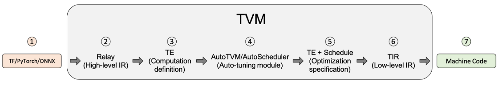

参考:

[TVM学习仓库](https://github.com/BBuf/tvm_mlir_learn)

[B站-zomi酱](https://space.bilibili.com/517221395/channel/collectiondetail?sid=857162)

[MLIR入门理解](https://zhuanlan.zhihu.com/p/450022851)

<!-- more -->
# AI编译器基础
## 1. 编译器相关

编译器（Compiler）和解释器（Interpreter）：

- 编译器：将源代码整体编译为可执行文件（机器码），（可能经过预编译、编译、汇编、链接等环节，统一视作编译器的流程）最后由机器执行，会产生可以重复使用的中间文件和可执行文件
- 解释器：将源代码逐行解释成字节码并直接交由机器执行，不产生其他文件

编译器编译方式：JIT 和 AOT

- AOT：AheadOfTime 即静态编译，源代码先统一编译成机器码，再执行
- JIT：JustInTime 即动态编译，相比于传统 AOT，JIT 可以在程序运行过程中变运行边编译，具体流程可以参考 java。注意 JIT 与解释器的区别，解释器的粒度为一行源代码，而 JIT 的粒度为一个函数，JIT 编译的函数可以重复使用，而解释器每次都要重新解释一遍。

一个 GCC 的标准编译流程：

1. 预处理：处理宏定义、文件包含、条件编译等信息，生成 .i 文件
2. 编译：对 .i 文件进行语法分析，优化后生成 .s 汇编文件
3. 汇编：将 .s 汇编文件汇编为机器码 .o 文件
4. 链接：将程序运行所需要的目标文件、依赖库文件等统一打包链接成一个可执行文件

LLVM 在 GCC 的基础上发展而来，早期苹果使用 GCC ，后来由于 GCC 证书以及苹果的商用需要，只能放弃 GCC 而单独发展出 LLVM，LLVM 本质算一个编译器的框架系统，使用模块化的方式，将编译器的前端、优化器、后端等模块分开，可以根据需要进行组合，比如目前主流的 Clang 就是 LLVM 的前端，而 LLVM 的后端可以生成多种平台的机器码，LLVM 的优化器也可以单独使用，这样就可以根据需要进行组合，而不是像 GCC 那样，前端、优化器、后端都是一体的，不可分割。

> *LLVM is a sort of abstracted assembly language that compiler developers can target as a backend, and then LLVM itself comes packaged with a host of optimizations and “real” backend targets that can be compiled to. If you’re, say, the Rust programming language and you want to compile to x86, ARM, and WebAssembly without having to do all that work, you can just output LLVM code and then run LLVM’s compilation suite.*

PASS：编译器对源代码进行完整的扫描，进行优化和分析的步骤
IR：Intermediate Representation 中间表达

编译器基本结构（主要是 LLVM，GCC 分的没有这么明确）

- Front End：词法分析、语法分析，将源代码转换为抽象语法树（AST），LLVM 使用 Clang 作为前端
- Optimizer：优化，将 IR 进行优化，使代码更高效（PASS 在这个地方）
- Back End：代码生成，将 IR 转换为目标代码（机器码）


> 相关 **Chris Lattner：The Golden Age of Compilers**

AI 编译器是介于机器学习框架与硬件中间的一层，用于解决众多框架与多种硬件之间的适配问题，主要架构

- Front-end：计算图转换，将不同框架下的源代码输出为 Graph IR 等高阶 IR（HLIR），重点在于抽象出硬件无关的计算和控制流程，以及数据张量、算子的支持
- Optimizer：对计算图进行一些算子融合、自动微分、并行切分、剪枝量化等优化，IR 间的相互转化，将高阶 IR 转换为低阶 IR（LLIR）
- Back-end：针对特定的机器，将低级 IR 转换为 LLVM IR，再利用 LLVM 基础结构生成优化的机器码

## 2. TVM
参考：

[TVM官方文档](https://tvm.hyper.ai/docs/arch/)

[TVM学习指南](https://zhuanlan.zhihu.com/p/560210215)

为什么使用 TVM：在模型部署时，众多的机器学习框架（Pytorch、TF、ONNX）与众多的平台（x86、arm、GPU）产生了众多不同的部署场景，而同一个模型在这些不同的场景之间是无法无缝切换的。TVM 的目标就是将这些不同的框架与平台进行统一，使得模型部署更加简单。

TVM 想要解决的问题：模型部署的可移植性问题、特定平台的硬件优化问题、软件栈的支持问题


### 编译流程


1. TVM前端将如ONNX、Pytorch下的模型引入到IRModule中，将其翻译为relay（此时IRModule由一种高级表示relay.Function组成，一个relay.Function通常对应一个端到端的模型，可将其视为额外支持控制流、递归和复杂数据结构的计算图）
2. Relay经过第一次转换，即Relay Passes，主要是与硬件无关的转换（常量折叠、死码消除等）
3. 在Relay优化的后期，TVM会运行一系列pass，以FuseOps（融合操作）开始，加上设备注解、布局重写、存储重写、图到函数转换等，将relay逐步转成te
> *重要的是，张量表达式te本身并不是一个可以存储到 IRModule 中的自包含函数（self-contained function）。相反，它是 IR 的一个片段，可以拼接起来构建一个 IRModule。*
4. 将te转为tir，使用autoTVM
5. tir经过一系列的tirPasses
6. IRMoudle转换成对应设备的runtime.Module由PackedFunc组成

Relay IR：如 relay.Function，TVM 为了兼容上层的机器学习框架而引入的中间表达，一种高阶的图结构，包含了计算图和控制流的信息，这样的设计使得 TVM 可以对模型进行更加全面的优化。Relax 是下一代 Relay（Relay Next）

Tensor IR：如 tir.PrimFunc，TVM 为了兼容不同的硬件而引入的中间表达，一种低阶的图结构，包含了数据张量和算子的信息，这样的设计使得 TVM 可以对硬件进行更加全面的优化。

IRModule：是TVM堆栈中的主要数据结构，也是TVM编译的最小完整单元，在上层一般由一个或多个relay.Function组成。一个 RelayFunc 通常对应一个端到端的模型（可见MLC）。经过 TIR Pass 后一个 RelayFunc 可降级为多个 tir.PrimFunc 即元张量函数，这些函数可以被 TVM 优化器进行优化，最后转化为机器码。


#### Pass 转换

TVM转换流程的目的：优化（如常量折叠、死码消除，针对特定张量的布局转换、scale因子折叠），以及降级（将代码逐渐转化成更接近硬件的低级表示。

在 relay/transform 流程的后期，FuseOps 将端到端的函数（即 relay.Function）转化为一个个的算子（即 tir.PrimFunc），这个过程帮助将原始的编译问题分为了两个子问题：
1. 算子的编译和优化
2. 整体的执行流程：对生成的算子进行的调用

tir/transform 流程主要处理 tir.PrimFunc 的降级，例如有些 pass 将多维访问展平为一维指针访问，将内联函数扩展至特定硬件的函数等。也有一些pass的目的仍是优化，如访问索引简化和死码消除。

#### AutoTVM：搜索空间和基于学习的转换

上述的转换都是确定且基于某一规则的。TVM的目标之一是支持不同硬件平台的高性能代码优化，因此往往要研究尽可能多的优化选择，包括多维张量访问、循环分块策略、特殊加速器内存。

首先定义一组用来转换程序的操作，包括循环转换、内联、向量化等，称为调度原语，这种原语组成的集合定义了可用于程序优化的搜索空间。接下来，系统搜索不同的可能调度序列，找到最佳（极佳）的调度组合。

AutoTVM和AutoScheduler是TVM中的两个自动调度器，AutoTVM是基于遗传算法的调度器，AutoScheduler是基于机器学习的调度器。在官方文档中似乎统一为AutoTVM介绍了。

> *使用基于搜索的优化来处理初始 tir 函数生成问题。*

AutoTVM是在tirPass之前进行的，经过AutoTVM后生成优化的PrimFunc，可以理解成到tirPass之后就不再进行高层优化了，只是针对硬件做一些特殊处理？

#### Target 转换

这一阶段将 tir 的 IRModule 转换为相应硬件的可执行形式。对于 x86 和 ARM 等后端，使用 LLVM IRBuilder 来构建内存中的 LLVM IR。还可以生成源代码级语言，例如 CUDA C 和 OpenCL。最后，还支持通过外部代码生成器将 Relay 函数（子图）直接转换为特定 target 。

**重要的是，这一阶段的转换要尽可能轻量级，因为绝大多数转换和降级都在之前的阶段完成**

#### Runtime 执行

> *TVM runtime 的主要目标是提供一个最小的 API，从而能以选择的语言（包括 Python、C++、Rust、Go、Java 和 JavaScript）加载和执行编译好的工件*

```python
import tvm
# Python 中 runtime 执行程序示例，带有类型注释
mod: tvm.runtime.Module = tvm.runtime.load_module("compiled_artifact.so")
arr: tvm.runtime.NDArray = tvm.nd.array([1, 2, 3], device=tvm.cuda(0))
fun: tvm.runtime.PackedFunc = mod["addone"]
fun(a)
print(a.numpy())
```
tvm.runtime.Module 封装了编译的结果。runtime.Module 包含一个 GetFunction 方法，用于按名称获取 PackedFuncs。

tvm.runtime.PackedFunc 是一种为各种构造函数消解类型的函数接口。runtime.PackedFunc 的参数和返回值的类型如下：POD 类型（int, float）、string、runtime.PackedFunc、runtime.Module、runtime.NDArray 和 runtime.Object 的其他子类。

tvm.runtime.Module 和 tvm.runtime.PackedFunc 是模块化 runtime 的强大机制。例如，要在 CUDA 上获取上述 addone 函数，可以用 LLVM 生成主机端代码来计算启动参数（例如线程组的大小），然后用 CUDA 驱动程序 API 支持的 CUDAModule 调用另一个 PackedFunc。OpenCL 内核也有相同的机制。

下面的代码片段给出了用相同接口执行端到端模型的示例：

```python
import tvm
# python 中 runtime 执行程序的示例，带有类型注释
factory: tvm.runtime.Module = tvm.runtime.load_module("resnet18.so")
# 在 cuda(0) 上为 resnet18 创建一个有状态的图执行模块
gmod: tvm.runtime.Module = factory["resnet18"](tvm.cuda(0))
data: tvm.runtime.NDArray = get_input_data()
# 设置输入
gmod["set_input"](0, data)
# 执行模型
gmod["run"]()
# 得到输出
result = gmod["get_output"](0).numpy()
```
主要的结论是 runtime.Module 和 runtime.PackedFunc 可以封装算子级别的程序（例如 addone），以及端到端模型。

### 逻辑架构组件


## 3. MLIR

参考
[某大佬博客](https://www.lei.chat/zh/posts/compilers-and-irs-llvm-ir-spirv-and-mlir/)


# TVM源码学习

## 代码拉取

```bash
git clone --recursive https://github.com/apache/tvm.git
git checkout v0.8
```

## 编译安装

### 编译常识

#### GCC

对于小项目来说，文件数量较少，使用GCC直接进行编译即可
1. g++:将源文件编译成.out可执行文件
2. g++ -c:将源文件编译成中间文件 而不进行链接，即编译成.o文件
3. g++ -o:将源文件或者.o文件进行编译+链接或链接，生成.out文件
4. 对于包含多个源文件的项目，可以将源文件分别gcc -c，再将产生的文件链接到一起，如`g++ -o myprogram file1.o file2.o`

#### make & makefile

然而随着计算机的发展，一个软件工程包含的源文件越来越多，手动逐个编译完全不可行，于是有个make和makefile。

Make 是一个批处理工具，它根据 Makefile 文件中的规则来构建项目。Make 可以确定哪些文件需要重新编译，哪些文件已经是最新的，从而只编译需要编译的文件。

Makefile：Makefile 是 Make 的配置文件，它包含了一系列的规则，用于指定如何构建项目。Make 通过读取 Makefile 文件来构建项目。

在这一阶段，工程师可以手写项目的makefile文件，再使用make指令统一构建整个项目

#### Cmake & CMakeLists

makefile在一些简单的工程下，完全可以人工手写，但是问题又来了，工程非常大的时候，连 makefile 的手写也非常麻烦，这时就需要一个工具可以自动生成 makefile ，这个工具就是cmake。

CMakeLists 是 Cmake 的配置文件。还是需要手写。

Cmake 会根据 CMakeLists 自动生成项目的 makefile 文件，然后再使用 make 构建项目。

Cmake 有不同的生成器，可以生成不同平台下的 makefile 文件，比如 Unix Makefile、Visual Studio、Ninja、Nmake等等，可以生成不同平台下的makefile，生成后再进行make就可以将项目构建在不同的平台下。

ninja是一种注重速度的生成器，使用ninja生成会产生一个build.ninja文件，然后使用ninja而非make进行构建

### 编译TVM

首先在 https://winlibs.com/ 拿到带 LLVM 库的 GCC 包，安装并加入环境变量，在cmd中可以使用 `llvm-config --libdir` 验证

创建build目录并`cp cmake/config.cmake build`并自定义配置，把USE LLVM打开

Conda创建tvm的虚拟环境，可以直接 `conda env create --file conda/build-environment.yaml` 但是使用该环境 git 会莫名奇妙出bug，不如手动创环境下载该文件中提到的依赖包

安装visual studio，把桌面C++开发组件勾上，安装完成后在cmd中使用`cl`验证（有没有可能除了装一个vs上述步骤全部不需要，但是不管了，官方文档安装部分相当混乱）

``` bash
mkdir build
cd build
cmake -A x64 -Thost=x64 ..
cd ..
cmake --build build --config Release -- /m
```

### 安装python包

在import tvm时如果未找到包，vscode会自动在工作区下创建配置帮你把tvm的路径加到 `python.analysis.extraPaths` 但实测虽然变绿且鼠标可以左键跳转了，但解释器还是找不到，可能需要改全局的python路径啥的

不如直接安装，环境变量引入包的好处在于源码更改后，引入可以立即感知；而install的包在每次源码更改后要重新install才能生效。但是我使用的v0.8的源码，已经没有更新了，所以直接安装也ok

``` bash
cd python
python setup.py install
```

## 用户手册

tvm/gallery

### introduction.py



TVM编译步骤：

1. 从 TensorFlow、PyTorch 或 ONNX 等框架导入模型。在导入阶段中，TVM 可以从其他框架（如 TensorFlow、PyTorch 或 ONNX）中提取模型。 TVM 为前端提供的支持水平会随着我们不断改进这个开源项目而变化。如果在将模型导入 TVM 时遇到问题，可以将其转换为 ONNX。

2. 翻译成 TVM 的高级模型语言 Relay。已导入 TVM 的模型在 Relay 中表示。Relay 是神经网络的功能语言和中间表示（IR）。Relay 应用图级优化 pass 来优化模型。

3. 降级为张量表达式（TE）表示。降级是指将较高级的表示转换为较低级的表示。应用了高级优化之后，Relay 通过运行 FuseOps pass，把模型划分为许多小的子图，并将子图降级为 TE 表示。张量表达式（TE）是一种用于描述张量计算的领域特定语言。 TE 还提供了几个 schedule 原语来指定底层循环优化，例如循环切分、矢量化、并行化、循环展开和融合。为将 Relay 表示转换为 TE 表示，TVM 包含了一个张量算子清单（TOPI），其中包含常用张量算子的预定义模板（例如，conv2d、transpose）。

4. 使用 auto-tuning 模块 AutoTVM 或 AutoScheduler 搜索最佳 schedule。schedule 为 TE 中定义的算子或子图指定底层循环优化。auto-tuning 模块搜索最佳 schedule，并将其与 cost model 和设备上的测量值进行比较。TVM 中有两个 auto-tuning 模块，AutoTVM（有模板）和Ansor（无模板）。

5. 为模型编译选择最佳配置。调优后，auto-tuning 模块会生成 JSON 格式的调优记录。此步骤为每个子图选择最佳 schedule。

6. 降级为张量中间表示（TIR，TVM 的底层中间表示）。基于调优步骤选择最佳配置后，所有 TE 子图降级为 TIR 并通过底层优化 pass 进行优化。接下来，优化的 TIR 降级为硬件平台的目标编译器。这是生成可部署到生产的优化模型的最终代码生成阶段。

7. 编译成机器码。compiler-specific 的生成代码最终可降级为机器码。 TVM 可将模型编译为可链接对象模块，然后轻量级 TVM runtime 可以用 C 语言的 API 来动态加载模型，也可以为 Python 和 Rust 等其他语言提供入口点。或将 runtime 和模型放在同一个 package 里时，TVM 可以对其构建捆绑部署。


### autotvm_relay_x86.py
使用TVM的Python API编译、训练和调优与训练的模型。

#### 导入依赖，并下载和加载ONNX模型
使用ResNet-50 v2，一个50层的用于图像分类的卷积神经网络，可以使用[Netron](https://netron.app/)检查模型结构。输入图像为224×224，模型已经预训练好。

``` python
import onnx
from tvm.contrib.download import download_testdata
from PIL import Image
import numpy as np
import tvm.relay as relay
import tvm
from tvm.contrib import graph_executor

model_url = (
    "https://github.com/onnx/models/raw/main/"
    "vision/classification/resnet/model/"
    "resnet50-v2-7.onnx"
)

model_path = download_testdata(model_url, "resnet50-v2-7.onnx", module="onnx")
onnx_model = onnx.load(model_path)

# 为 numpy 的 RNG 设置 seed，保证每次复现得到一致的结果
np.random.seed(0)
```

#### 下载和预处理图像
将图像转为Numpy数组

``` python
img_url = "https://s3.amazonaws.com/model-server/inputs/kitten.jpg"
img_path = download_testdata(img_url, "imagenet_cat.png", module="data")

# 重设大小为 224x224
resized_image = Image.open(img_path).resize((224, 224))
img_data = np.asarray(resized_image).astype("float32")

# 输入图像是 HWC 布局，而 ONNX 需要 CHW 输入，所以转换数组
img_data = np.transpose(img_data, (2, 0, 1))

# 根据 ImageNet 输入规范进行归一化
imagenet_mean = np.array([0.485, 0.456, 0.406]).reshape((3, 1, 1))
imagenet_stddev = np.array([0.229, 0.224, 0.225]).reshape((3, 1, 1))
norm_img_data = (img_data / 255 - imagenet_mean) / imagenet_stddev

# 添加 batch 维度，期望 4 维输入：NCHW。
# N:number of samples，即batch size C:channels H:height W:width
img_data = np.expand_dims(norm_img_data, axis=0)
```

#### 使用Relay编译模型
将模型转为Relay中间表示（IR）。首先用 from_onnx 导入器将模型导入到 Relay 中。然后，用标准优化，将模型构建到 TVM 库中，最后从库中创建一个 TVM 计算图 runtime 模块。

``` python
# 输入名称可能因模型类型而异
# 可用 Netron 工具检查输入名称
input_name = "data"
target = "llvm"

# 定义输入的形状字典，键是模型固定的输入名称，值是输入形状，用于指定ONNX模型的输入形状
shape_dict = {input_name: img_data.shape}

# 将ONNX模型转换为Relay中间表示（IR）
mod, params = relay.frontend.from_onnx(onnx_model, shape_dict)

# 构建和编译模型
with tvm.transform.PassContext(opt_level=3):
    # 使用Relay构建模型并编译为目标为"llvm"的库
    lib = relay.build(mod, target=target, params=params)

# 创建"llvm"设备
dev = tvm.device(target, 0)

# 创建GraphModule并加载编译好的模块
module = graph_executor.GraphModule(lib["default"](dev))
```
`relay.frontend.from_onnx`接受一个ONNX模型和一个形状字典作为输入，返回一个Relay模块（mod）和一个参数字典（params）

mod是整个模型的计算图，params是模型的参数字典，包含了模型的权重和偏置等参数

`tvm.transform.PassContext`是TVM控制优化过程的上下文，`opt_level=3`代表启用所有推荐优化
lib是编译后生成的模块库，包含模型计算图、参数和编译后的函数，它将可以被加载到一个GraphModule中，并在指定设备上执行

`dev = tvm.device(target, 0)`和`module = graph_executor.GraphModule(lib["default"](dev))` 分别创建了一个device对象和一个GraphModule对象（图执行模块）
可以在上面运行上面编译好的lib库

#### 使用模型进行推理

直接运行模型进行预测，并将输出转为可读形式。并收集此时还未优化过的模型基本性能数据

``` python
# 运行模型
dtype = "float32"
module.set_input(input_name, img_data)
module.run()
output_shape = (1, 1000)
tvm_output = module.get_output(0, tvm.nd.empty(output_shape)).numpy()

from scipy.special import softmax

# 下载标签列表
labels_url = "https://s3.amazonaws.com/onnx-model-zoo/synset.txt"
labels_path = download_testdata(labels_url, "synset.txt", module="data")

with open(labels_path, "r") as f:
    labels = [l.rstrip() for l in f]

# 打开输出文件并读取输出张量
scores = softmax(tvm_output)
scores = np.squeeze(scores)
ranks = np.argsort(scores)[::-1]
for rank in ranks[0:5]:
    print("class='%s' with probability=%f" % (labels[rank], scores[rank]))

# 运行时间评估
import timeit
timing_number = 10
timing_repeat = 10
unoptimized = (
    np.array(timeit.Timer(lambda: module.run()).repeat(repeat=timing_repeat, number=timing_number))
    * 1000
    / timing_number
)
unoptimized = {
    "mean": np.mean(unoptimized),
    "median": np.median(unoptimized),
    "std": np.std(unoptimized),
}
```


#### 输出后处理
用专为该模型提供的查找表，运行一些后处理（post-processing），从而使得 ResNet-50 v2 的输出形式更具有可读性

``` python
from scipy.special import softmax

# 下载标签列表
labels_url = "https://s3.amazonaws.com/onnx-model-zoo/synset.txt"
labels_path = download_testdata(labels_url, "synset.txt", module="data")

with open(labels_path, "r") as f:
    labels = [l.rstrip() for l in f]

# 打开输出文件并读取输出张量
scores = softmax(tvm_output)
scores = np.squeeze(scores)
ranks = np.argsort(scores)[::-1]
for rank in ranks[0:5]:
    print("class='%s' with probability=%f" % (labels[rank], scores[rank]))
```

#### 进行模型调优
用编译的模块推理，有时可能无法获得预期的性能。在这种情况下，可用自动调优器更好地配置模型，从而提高性能。 TVM 中的调优是指，在给定 target 上优化模型，使其运行得更快。与训练或微调不同，它不会影响模型的准确性，而只会影响 runtime 性能。作为调优过程的一部分，TVM 实现并运行许多不同算子的变体，以查看哪个性能最佳。这些运行的结果存储在调优记录文件中。

``` python
import tvm.auto_scheduler as auto_scheduler
from tvm.autotvm.tuner import XGBTuner
from tvm import autotvm

number = 10
repeat = 1
min_repeat_ms = 0  # 调优 CPU 时设置为 0
timeout = 10  # 秒

# 创建 TVM 运行器
runner = autotvm.LocalRunner(
    # 将要测试的不同配置的数量
    number=number,
    # 每个配置重复次数
    repeat=repeat,
    # 每次测试运行时间上限
    timeout=timeout,
    # 指定运行配置测试需要多长时间，如果重复次数低于此时间，则增加其值
    min_repeat_ms=min_repeat_ms,
    enable_cpu_cache_flush=True,
)

tuning_option = {
    "tuner": "xgb",
    # 试验次数，CPU上推荐1500，GPU推荐3000-4000，此处仅作展示用
    "trials": 10,
    # 使搜索提前停止的实验最小值
    "early_stopping": 100,

    "measure_option": autotvm.measure_option(
        builder=autotvm.LocalBuilder(build_func="default"),
        runner=runner
    ),
    # 调优数据保存的文件名
    "tuning_records": "resnet-50-v2-autotuning.json",
}
```

``` python
# 首先从 onnx 模型中提取任务
tasks = autotvm.task.extract_from_program(mod["main"], target=target, params=params)

for i, task in enumerate(tasks):
    prefix = "[Task %2d/%2d] " % (i + 1, len(tasks))
    tuner_obj = XGBTuner(task, loss_type="rank")
    tuner_obj.tune(
        n_trial=min(tuning_option["trials"], len(task.config_space)),
        early_stopping=tuning_option["early_stopping"],
        measure_option=tuning_option["measure_option"],
        callbacks=[
            autotvm.callback.progress_bar(tuning_option["trials"], prefix=prefix),
            autotvm.callback.log_to_file(tuning_option["tuning_records"]),
        ],
    )
```

#### 使用生成的调优数据优化编译模型

获取上述存储在`resnet-50-v2-autotuning.json` 中的调优记录，并使用该结果为指定target上的模型生成高性能代码

``` python
with autotvm.apply_history_best(tuning_option["tuning_records"]):
    with tvm.transform.PassContext(opt_level=3, config={}):
        lib = relay.build(mod, target=target, params=params)

dev = tvm.device(str(target), 0)
module = graph_executor.GraphModule(lib["default"](dev))

# 验证模型是否产生相同的结果
dtype = "float32"
module.set_input(input_name, img_data)
module.run()
output_shape = (1, 1000)
tvm_output = module.get_output(0, tvm.nd.empty(output_shape)).numpy()

scores = softmax(tvm_output)
scores = np.squeeze(scores)
ranks = np.argsort(scores)[::-1]
for rank in ranks[0:5]:
    print("class='%s' with probability=%f" % (labels[rank], scores[rank]))
```

#### 比较调优前后的模型性能

``` python
import timeit

timing_number = 10
timing_repeat = 10
optimized = (
    np.array(timeit.Timer(lambda: module.run()).repeat(repeat=timing_repeat, number=timing_number))
    * 1000
    / timing_number
)
optimized = {"mean": np.mean(optimized), "median": np.median(optimized), "std": np.std(optimized)}

print("optimized: %s" % (optimized))
print("unoptimized: %s" % (unoptimized))
```