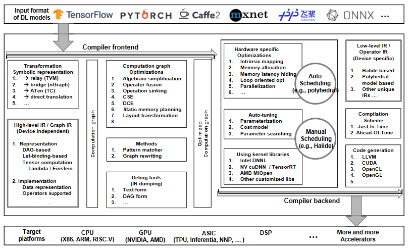

事已至此，先看论文吧：P

*The Deep Learning Compiler: A Comprehensive Survey*

2020的一篇有关AI编译器的综述，来自北航和清华

# *The Deep Learning Compiler: A Comprehensive Survey*

## Abstract

由于AI芯片的高度定制化，使得在不同硬件上部署各种深度学习模型变得十分困难，这也推动了深度学习编译器的研究。业界因此推出了一些深度学习编译器，如Tensorflow XLA和TVM。与传统编译器类似的是，深度学习编译器将不同的深度学习框架中描述的深度学习模型作为输入，然后为不同的硬件生成优化后的代码作为输出。

然而现有的文章都没有全面分析深度学习编译器独特的设计架构。本文将对现有DL编译器做全面剖析，重点在DL的多级IR及前/后端优化。

这是第一篇关于DL编译器设计体系结构的综述性论文。

## 1. Introduction

先讲深度学习对于各个领域的深远影响blablabla

然后说当前业界的几种主流框架，如TensorFlow、PyTorch，MXNet和CNTK等，同时提出这些框架如果需要支持新的模型，interoperability（互操作性，复用性？）会变得非常重要。为了提供复用性，我们又提出了ONNX，定义了一种DL模型的统一格式，以促进不同框架间模型的相互转换。

然后说各大公司对开发DL专用硬件的巨大投入。在可预见的未来，深度学习芯片的设计会变得越来越多样化。

要包容硬件的多样性，就必须将计算高效的映射到各种硬件上。在通用硬件上，一些专用的依赖库可以实现DL模型的高效计算，在许多专用的DL芯片上也有类似的库。但是依赖库的缺点是，库的开发和更新通常跟不上DL模型的飞速发展，无法真正有效的利用DL芯片。

为了解决DL库和其他工具的类似缺点，并减轻DL芯片上每个模型都需要手动优化的负担，DL社区开始发展DL编译器。针对不同的模型和硬件架构，DL编译器对模型定义到特定代码实现之间的转换进行的高度优化。同时还利用通用编译器如LLVM的成熟工具链，在各种硬件架构间提供更好的可移植性。与传统编译器类似，DL编译器也采用分层设计，包括前端、多级IR和后端。

本文贡献：blablabla

## 2. Background

### 2.1 深度学习框架

介绍目前流行的几种框架

### 2.2 深度学习硬件

当前AI芯片的粗略分类：

1. 通用AI硬件：GPGPU，如Nvidia的Volta架构，辅以深度学习加速库如cuDNN，已经一些TensorRT之类的库
2. 专用AI硬件：如Google TPU
3. Neuromorphic Hardware：略略略

### 2.3 硬件相关的DL代码生成器

讲FPGA，略略略

## 3. COMMON DESIGN ARCHITECTURE OF DL COMPILERS

DL编译器的通用架构一般包含两部分：编译器前端和后端，中间表示IR在前后端之间，处理优化工作。其中IR都分多级，高级IR用于前端，偏向硬件无关的转换和优化；低级IR用于后端，偏向硬件相关的转换和优化、代码生成、编译等

高阶IR即图IR，用于表示硬件无关的计算和控制流，设计难点在于计算和控制流的抽象。有了这种抽象能力就可以捕获和表示各种DL模型。其目标在于建立控制流以及算子与数据之间的依赖关系，并为图级优化提供接口。此外高阶IR还需要包含编译所需的语义信息，并为自定义算子提供可扩展性。

低阶IR用于硬件相关的优化和代码生成。因此，低阶IR更注重细节，反映硬件特性，准确表示硬件相关优化。并且应该能够在后端使用成熟的第三方工具链。

前端从DL框架获取模型作为输入，然后将其转化为计算图表示形式。为了支持不同的框架，前端需要支持并实现不同格式的相互转换。计算图的优化可以分为节点级别（消除nop和零维张量）、块级别（代数简化、算子融合）、数据流级别（CSE、DCE、静态内存规划）。生成的优化计算图会传递给后端。

后端收到高阶IR（计算图）后，将高阶IR转换为LLVM IR等第三方工具链，这样就可以利用已有工具完成通用优化和代码生成。此外，后端还可以利用DL模型和硬件特性的先验知识来优化代码生成，如硬件固有映射、内存分配、内存延迟隐藏、并行化、循环优化等。为了在大的优化空间中确定最佳参数，现有的DL编译器广泛采用两种方法，**Auto-Tuing（如AutoTVM）和Auto-Scheduling（如AutoScheduler）**。优化后的低阶IR再经过JIT或AOT编译，生成面向不同硬件目标的机器码。

## 4. KEY COMPONENTS OF DL COMPILERS

### 4.1 高阶IR

传统编译器中采用的IR表示能力限制了DL模型中复杂计算的表达，现在的DL编译器都会采用高阶IR（称为图IR）和一些特殊设计，以求达到高效的代码优化。为了更好地理解DL编译器中使用的图IR，以下描述了图IR的表示和实现。

#### 4.1.1 图IR的表示形式

> 图IR的表示方式决定了DL编译器分析图IR的方式

**基于DAG的IR**

DAG即有向无环图，在DL编译器中，DAG的节点表示算子，边表示张量。通用编译器一般使用DDG即数据依赖图完成如公共子表达式消除CSE和死代码消除DCE之类的优化，而借助DAG，DL编译器同样可以实现这些。

基于DAG的IR由于表达方式的简单，便于编程和编译，但由于基于DAG的IR缺少计算范围定义，因而存在诸如语义二义性这类缺陷。

**基于Let-binding的IR**

基于Let绑定的IR-Let绑定是一种解决语义歧义的方法，它为Javascript等许多高级编程语言使用的某些范围有限的函数提供Let表达式。当使用let关键字定义表达式时，会生成一个let节点，然后它指向表达式中的运算符和变量，而不仅仅是将变量之间的计算关系构建为DAG。在基于DAG的编译器中，当进程需要获得一个表达式的返回值时，它首先访问相应的节点并搜索相关的节点，也称为递归下降技术。相反，基于let绑定的编译器计算出let表达式中变量的所有结果，并构建变量映射。当需要特定的结果时，编译器会查找此映射来决定表达式的结果。在DL编译器中，TVM的Relay IR同时采用了基于DAG的IR和基于let绑定的IR，以获得两者的好处。

**张量的计算表示**

不同的图IR表示张量计算的方式也不同

1. 基于函数的表示：XLA、nGraraph
2. Lambda表示：TVM
3. 爱因斯坦符号表示

#### 4.1.2 图IR的实现

DL编译器中的数据通常以张量的形式进行组织，也即多维数组。编译器可以通过内存指针访问张量，或通过更灵活的占位符方式表示。占位符需要包含张量每个维度的大小，有时也可以标记成未知。此外，出于优化的原因，DL编译器需要数据布局信息，也应该可以根据占位符推断迭代器的边界。

**占位符**

占位符广泛应用于符号编程，如Tensorflow。占位符用于提供数据给计算图，是一种具有明确形状信息的变量。无初始值，声明只分配必要内存。有助于计算与编译器执行的分离。

**未知形状表示**

与Tensorflow类似，TVM使用any表示未知维度。未知形状的表示对动态模型必不可少，但是要完全支持动态模型，还要放宽边界推断和维度检查，以及额外的机制来确保内存有效性。

**数据布局**

张量都是放在特定数据布局和形状下。数据布局用来描述张量在内存中的组织方式，一般是一个从逻辑索引到内存索引的映射方式。合适的数据布局对性能提升非常关键，特别是对于深度学习模型之类内存密集型的应用而言。数据布局通常包括维度顺序（NCHW or NHWC）、平铺（tiling）、填充（padding）、跨距（striding）等。

TVM和GLOW将数据布局当作一种算子的参数，因为计算和优化需要这些参数信息。

**边界推断**

尽管DL编译器使用张量的数据表示可以很方便的描述输入和输出，但这种方式在推断迭代器边界时会有困难。边界推断通常根据计算图和已知占位符，以迭代或递归的方式执行

**算子支持**

算子就是计算图中的节点，通常包含代数算子（加减乘除等）、神经网络算子（卷积、池化等）、张量算子（reshape、resize等）、广播\规约算子（min、argmin等），以及控制流算子（条件和循环等），下面对三个特定的算子进行说明：
1. 广播算子：。。。
2. 控制流算子：任何控制流都可以通过递归和模式来实现，正因为这一点，Relay可通过函数式编程来描述复杂的深度神经网络。
3. Derivative算子：略略略 看不明白

**算子定制**

程序员可以定制算子。

#### 4.1.3 讨论

几乎所有的DL编译器都有其独特的高阶IR，重要的是高阶IR与硬件无关。

### 4.2 低阶IR

#### 4.2.1 实现

与高阶IR相比，低阶IR用更细的粒度描述了DL模型的计算，并提供计算调优和内存访问接口，实现目标相关的优化。本节将低阶IR分为三类：基于Halide的IR，基于多面体的IR和其他IR。

**基于Halide的IR**

TVM将Halide IR改进为独立的符号IR，主要的两点：首先，TVM消除了对LLVM的依赖，并重构了项目模块和Halide IR设计的结构，优化了代码组织，使得图IR和前端语言（如Python）更易于理解，并且通过运行时分发机制，可以方便地添加自定义算子。如此一来，可重用性也得到了改善。 其次，TVM还简化了从字符串匹配到指针匹配的变量定义，确保每个变量都具有一个定义位置，即，静态单赋值（Static Single-Assignment, SSA）。

**基于多面体的IR**

多面体（Polyhedral-based）模型是在某些DL编译器采用的一项重要技术。多面体模型使用线性编程、仿射变换和其它数学方法来优化基于loop循环的代码，代码可以具有边界和分支的静态控制流。与Halide相比，内存引用和循环嵌套的边界可以是多面体模型中具有任何形状的多面体。这种灵活性使多面体模型在通用编译器中得到广泛使用。但是，这种灵活性也妨碍了多面体模型与调优机制的集成。但是，由于能够处理深度嵌套的循环，很多DL编译器（例如TC和PlaidML）都采用了多面体模型作为其低阶IR。基于多面体的IR可以很容易地应用于各种多面体转换（例如融合、平铺、下沉和映射），不论是设备相关还是设备不相关的优化。基于多面体的编译器兼容很多其它工具链，例如isl、Omega、PIP、Polylib和PPL。

TC的低阶IR设计较为独特，其设计结合了Halide和多面体模型，也就是用基于Halide的IR表示计算，用基于多面体的IR表示loop结构。 TC通过抽象实例表示表达式，并引入了特定的节点类型。简而言之，TC用域节点来指定索引变量的范围，用上下文节点描述与硬件相关的、新的迭代变量，用band节点确定迭代顺序，用过滤器节点表示与语句实例结合的迭代器，用Set和sequence是指定过滤器的执行类型（并行和串行执行），用扩展节点来描述代码生成所需的其它必要指令，例如内存搬移。

PlaidML使用基于多面体的IR（称为Stripe）来表示张量操作，并且通过将并行多面体块的嵌套挤结构扩展到多个级别，创建可并行化代码的层次结构。PlaidML可以将嵌套的多面体分配给嵌套的内存单元，做到计算与存储层次结构的匹配。Stripe中的硬件配置独立于内核代码。 Stripe中的标记tag（在其他编译器中称为pass）不会更改内核结构，但会为优化pass提供硬件目标的其它信息。 Stripe将DL算子拆分为适合本地硬件资源的块（tile）。

**其他IR**

有些DL编译器无需使用Halide和多面体模型就可实现定制低阶IR。定制低阶IR将硬件相关的优化和降级操作应用到LLVM IR上。

Glow中的低阶IR是基于指令的表达式，可对通过地址引用的张量进行操作。Glow低阶IR中有两种基于指令的函数：声明和程序。声明用于表示在程序的整个生命周期都存在的常量内存区域数量（例如，输入、权重、偏置等）。程序是一系列本地分配的区域，包括函数（比如conv和pool）和临时变量。指令可以在全局内存区域或本地分配的区域上运行。此外，每个操作数都用一个限定符修饰。@in表示操作数从缓冲区中读取；@out表示操作数写入缓冲区；@inout表示操作数读取和写入缓冲区。这些指令和操作数限定符可帮助Glow确定在什么时候可以执行什么样的内存优化。

MLIR受LLVM的影响很大，但MLIR是一个比LLVM更纯粹的编译器基础结构。MLIR复用了LLVM中的许多想法和接口，其定位在模型表示和代码生成之间。MLIR有灵活的类型系统和多层抽象级别，并引入了dialect来表示这些抽象级别。每个dialect都由一组定义好的不可变操作组成。MLIR的当前dialect包括TensorFlow IR、XLA HLO IR、多面体IR、LLVM IR和TensorFlow Lite，并支持dialect之间的转换。此外，MLIR可以创建新的dialect连接到低阶编译器。

XLA的HLO IR既可以被视为高阶IR，也可以被视为低阶IR，因为HLO的粒度足以表示硬件信息。此外，HLO支持硬件相关优化，并可用于生成LLVM IR。

#### 4.2.2 基于低阶IR的代码生成

大多数DL编译器采用的低阶IR最终可以降级到LLVM IR，并利用LLVM成熟的优化器和代码生成器产生机器码。此外，LLVM可以从0开始，为专用加速器设计定制指令集。但是，如果直接将低阶IR转换为LLVM IR，传统的编译器生成的代码质量可能较差。为了避免这种情况，DL编译器采用了两种方法来实现硬件相关优化：
1. 在LLVM的上层IR（例如，基于Halide的IR和基于多面体的IR）中执行目标相关的loop循环转换
2. 为优化pass提供更多硬件目标相关信息，帮助改善优化效果。

大多数DL编译器都应用这两种方法，但是侧重点有所不同。通常，偏向前端用户的DL编译器（例如TC、TVM、XLA和nGraph）可能专注于第一点，而偏向后端开发人员的DL编译器（例如Glow、PlaidML和MLIR）可能专注于第二点。

DL编译器中的编译方案主要可分为两类：JIT（Just-In-Time）和AOT（Ahead-Of-Time）。JIT编译器可以即时生成可执行代码，并且可以利用运行时信息优化代码。 AOT编译器首先生成所有可执行二进制文件，然后再执行。因此， AOT编译器的静态分析范围比JIT编译器更大。此外，AOT方法可以用于嵌入式平台的交叉编译器，并可以在远程计算机和定制加速器上执行。

#### 4.2.3 讨论

在DL编译器中，低阶IR是DL模型的细粒度表示，主要描述了DL模型移植到各种不同硬件上所需的详细信息。低阶IR包括基于Halide IR、基于多面体IR和其它IR。尽管这些低阶IR在设计上有所不同，但是都通过已有的成熟编译器工具链和基础结构，提供硬件相关的优化和代码生成接口。低阶IR的设计也会影响到DL加速器的设计（例如TVM Halide IR和Inferentia，以及XLA HLO和TPU）。

### 4.3 前端优化

构造计算图后，编译器前端就可以开始执行图级优化。由于计算图提供了计算的全局视图，因此很容易在图这个级别识别判断并执行各种优化方法。这些优化方法与硬件无关，仅适用于计算图，不适用于后端实现。

前端优化通常通过pass来定义，用于遍历计算图的节点并执行图转换。前端功能主要包括两个：第一，从计算图捕获特定特征；第二，重写图以便进行优化。除了预定义pass，开发者也可以在前端定制pass。DL模型导入并转换为计算图后，大多数DL编译器就可以确定操作的输入输出张量的形状

在本节中，我们将前端优化分为三类：节点级优化、块级（窥孔、局部）优化和数据流级（全局）优化。

#### 4.3.1 节点级

节点级优化包括消除不必要的节点（即节点消除），以及将节点替换为其它低成本节点（即节点替换），如消除只有一个输入的求和节点，或某个输入为零维张量的求和节点，以及一些零填充宽度的填充节点。

#### 4.3.2 块级优化

**代数简化**

包括代数识别、强度消减和常量折叠。

代数识别：利用不同类型节点的交换律、结合律和分配律来简化计算

强度消减：用便宜的算子代替更昂贵的算子

常量折叠：使用常量代替常量表达式

**算子融合**

核心思想是将多个算子合并为一个内核，这样无需将中间结果写回内存，减少了中间变量的分配时间。

**算子下沉**

这种优化方法将诸如转置之类的运算下沉到批标准化（batch normalization）、ReLU、Sigmoid和通道混洗（shuffle）之类的运算之下。通过这种优化，许多彼此相似的操作相互靠近，从而为代数简化优化创造更多机会。

#### 4.3.3 数据流级优化

**CSE：公共子表达式消除**

如果某表达式的值已经得到，并且在后续计算中不会再改变，就称为公共子表达式。DL编译器会在整个计算图中搜索该公共子表达式，并使用已经计算好的值替换，避免重复计算。

**DCE：死代码消除**

如果代码的计算结果未被使用，或代码无法执行和访问，则可将这些代码视为死代码。死代码消除是一种常见编译优化技术，目的是移除对程序运行结果没有影响的死代码，减少最终生成代码的大小。

传统编译器基于活跃变量分析进行死代码消除优化。DL计算图中的死代码通常是由其它图优化造成的。因此，在其它图优化之后还应执行死代码消除和公共子表达式消除。因为不同于传统编译器的低阶IR，DL编译器中的死代码消除的操作对象是高级图IR。因此DL编译器中的死代码消除会有一些传统编译器不具备的操作。例如，如果存储操作的目的张量在后续计算中不再使用，则存储操作可以被删除。这也属于死代码消除。

**静态内存规划**

静态内存规划的目的是尽可能重用内存缓冲区。静态内存规划通常有两种：就地（in-place）内存共享和标准内存共享。对于采用就地内存共享的操作，其输入和输出占用相同的内存，并在计算之前仅分配一个内存副本。标准内存共享可重复使用先前操作的内存，而不会出现重叠。静态内存规划离线执行，这样就可以采用更复杂的规划算法。

**布局转换**

传统编译器中有成熟且使用广泛的结构数据布局优化（Structure Data Layout Optimizations），目的是提高数据局部性，减少缓存未命中率。

AI编译器的布局转换，其目的是优化计算图中张量的数据布局，并在途中出插入布局转换节点。注意这时尚未执行实际的转换，而是待到编译器后端评估计算图时才执行实际的转换。

同一种算子在不同的数据布局上性能是不同的，而不同硬件的最佳数据布局也不同.例如，在GPU上，NCHW格式的操作通常运行速度更快，因而其它格式的张量可以先转换为NCHW格式。有些DL编译器依赖于硬件相关的库来实现更高的性能，而这些库可能对布局有要求。此外，边缘设备通常配备异构计算单元，不同类型的单元可能要求不同的数据布局。因此，AI芯片编译器需要提供在各种硬件之间做布局转换的优化方法。

布局转换本身的开销也很可观。

#### 4.3.4 讨论

前端是DL编译器中最重要的组件之一，负责从DL模型到计算图高​​级IR的转换，以及基于高阶IR的硬件无关优化。虽然不同AI芯片编译器前端实现在高阶IR的数据表示和算子定义上有所不同，但与硬件无关的优化都可以分为三个层次：节点级、块级和数据流级。每个层次的优化方法都利用了DL特有方法和常规的编译优化技术，从而减少了计算冗余，提高了DL模型在计算图层次的性能。

### 4.4 后端优化

DL编译器后端通常包括各种硬件相关优化、自动调优技术和优化的内核库。硬件相关优化可以针对不同硬件目标实现高效的代码生成，自动调优技术可以极大减轻推导最佳参数配置的手动工作量，高度优化的内核库广泛用于通用处理器和定制DL加速器。

在代码生成方面，传统编译器的目标是生成优化的通用代码，**而AI编译器的目标是为特定算子（如卷积，矩阵乘等）生成性能达到或超过手动调优算子的代码实现。作为代价，AI编译器可能要牺牲编译时间去搜索最优配置。**

#### 4.4.1 硬件相关优化

硬件相关优化（或目标相关优化）用于获得针对特定硬件的高性能代码。某一个途径是将低阶IR转为LLVM IR，以利用LLVM来生成优化的CPU/GPU代码；另一个途径是利用DL知识来设计定制的优化。

文章介绍了几个比较经典的硬件相关优化方法：

**硬件固有映射**

硬件固有映射可以将某组低级IR指令转换为已经在硬件上高度优化的内核。

在TVM中，硬件固有映射是用可扩展张量化的方法实现的，它可以声明硬件固有映射的行为和固有映射的下降规则。这种方法使编译器后端能够将硬件实现以及高度优化的手工微内核应用于特定的操作模式，从而显著提高性能。

**内存分配和获取**

对于GPU和定制加速器，内存分配是代码生成中的一个主要难点。例如，GPU主要包含共享内存空间（容量小但访问延迟较低）和本地内存空间（大容量但访问延迟较高）（3global，2shared，1local，0reg）。这样的内存层次结构需要高效的内存分配和获取技术才能改善数据局部性。为了实现内存分配和获取优化，TVM引入了内存作用域调度（TVM小节中应增加这部分内容？）的概念。内存作用域调度原语可以将某个计算阶段标记为共享或线程本地（thread-local）。对于标记为共享的计算阶段，TVM通过共享内存分配和协作数据获取方式生成代码，这种方式会在适当的代码位置插入内存栅栏（barrier）以保证正确性。而TC通过扩展PPCG编译器提供了类似的功能（称为内存提升）。但是，TC仅支持有限的预定义规则。特别是，TVM可以通过内存作用域调度原语在加速器中实现了特殊缓冲功能。

**内存延迟隐藏**

不论是何种处理器，延迟都包括两种：计算延迟和内存访问延迟。与计算速度相比，内存访问速度要慢得多，并且能耗要大得多。为了提高性能，处理器要花费大量资源来隐藏和减少内存延迟，内存延迟隐藏通过重叠内存计算操作，使内存利用率和计算效率最大化，是后端中使用的一项重要技术。

为了隐藏等待时间，处理器使用乱序执行，将内存访问与其它工作重叠起来，并使用指令投机调度（speculative instruction scheduling）执行相关指令。为了减少延迟，处理器使用了多级缓存，使常用数据更靠近处理器。但是，这些优化措施各有代价。乱序执行需要昂贵的处理器资源，指令投机调度必须在推测错误时重新执行指令，而多级缓存则需要额外的计算和延迟来搜索缓存。

由于大多数DL编译器都支持CPU和GPU上的并行化执行，因此可以通过芯片硬件实现内存延迟隐藏。但是，针对不同的硬件，需要采用不同的延迟隐藏策略。例如，GPU通过线程束调度器调度线程束参与指令（流水线）的执行，通过快速的切换线程束，最大化利用功能单元。如果有足够的并发活跃线程束，线程束调度器可以让GPU在每个流水线阶段都处于忙碌状态，GPU的内存指令延迟就可以被其它线程束的计算隐藏。但是对于具有解耦访问执行（DAE, Decoupled Access-Execute）架构的类似TPU的加速器，编译器后端需要执行调度和细粒度的同步才能生成正确且高效的代码。为了获得更好的性能，减少编程负担，TVM引入了虚拟线程调度原语，用户可以在虚拟化多线程体系结构上指定数据并行性。然后，TVM通过插入必要的内存栅栏指令来降低虚拟并行线程的数量，并将这些线程的操作交织到一个指令流中，形成更合理的线程执行流水线，这样就可以隐藏内存访问延迟。

**面向循环的优化**

**并行化**

并行化是提高深度学习模型中计算密集操作效率的关键。由于现代处理器通常都支持多线程和SIMD并行性，因此，编译器后端可以利用并行性来提高硬件利用率，实现性能最优化。 Halide使用并行调度原语来并行化计算任务，为线程级并行指定循环的并行化维度。其中的每个并行任务可以进一步递归地细分为子任务，以便充分利用目标体系结构上的多级线程层次结构。Halide可以用向量语句替换循环，然后通过硬件intrinsic映射将向量语句映射到硬件相关的SIMD操作码。 Stripe将多面体模型扩展为嵌套多面体模型，引入了并行多面体块这个概念作为迭代的基本执行元素。扩展之后，嵌套多面体模型可以检测平铺和跨度级别之间的层次结构并行化。另外，有些DL编译器依赖于手工库，例如Glow或由硬件厂商提供的优化数学库（在第4.4.3节中讨论）。同时，Glow将向量化处理放到LLVM中完成，因为只要有张量尺寸和循环轮次信息，LLVM自动向量化功能就完全可以正常工作。

#### 4.4.2 自动调优

由于在硬件相关优化中用于参数调优的搜索空间巨大，因此有必要利用自动调优来确定最佳参数配置。在常用DL编译器中，TVM、TC和XLA支持自动调优。

自动调优实现通常包括四个关键部分：参数化、成本模型、搜索技术和加速。

**参数化**

数据和目标：数据参数描述数据的规格，例如输入形状。目标参数描述了在优化调度和代码生成过程中要考虑的硬件相关的特性和约束。对于GPU，需要指定硬件参数，如共享内存和寄存器大小。

优化选项：优化选项包括优化调度方法和相应的参数，例如面向循环的优化和图块大小。在TVM中，考虑了预定义调度和用户自定义调度以及其参数。

**成本模型**

1. 黑盒模型：TC采用了这种模型。此模型仅考虑最终执行时间，而不考虑编译任务的特征。建立黑匣子模型很容易，但是在没有任务特征指导的情况下，最终得到的可能是次优的解决方案。
2. 基于机器学习的成本模型：基于机器学习的成本模型是一种使用机器学习方法预测性能的统计方法。这种模型可以在探索新配置时进行更新，从而有助于实现更高的预测精度。TVM和XLA采用了这种模型。
3. 预定义成本模型：预定义成本模型是基于编译任务特征的模型，可以用于评估编译任务的整体性能。与基于ML的模型相比，预定义的模型在实际应用中产生的计算开销较小，但是需要大量的工作量才能在每个新DL模型和硬件上重建模型。

**搜索技术**

1. 初始化和确定搜索空间：初始选项可以随机设置，或者是根据经验配置。一般情况下，应在自动调优之前就指定搜索空间。TVM中，开发人员使用其特定域知识指定搜索空间，并基于计算描述提取每个硬件目标的自动搜索空间。而TC依赖于编译缓存和预定义规则获得搜索空间。
2. 遗传算法（Genetic Algorithm）：遗传算法是受自然选择过程启发的一种元启发法，属于自然进化算法大类。遗传算法通过一组候选解（称为个体，生物或表型）的交叉、变异和选择来解决优化问题。在搜索技术中，遗传算法将每个调优参数视为基因，并将每个配置视为候选解。根据适应度值，通过交叉、变异和选择来迭代生成新的候选配置。最后，得出最佳候选解。交叉，变异和选择的速率用于控制探索和开发之间的权衡。TC的自动调整技术采用了遗传算法。
3. 模拟退火算法（Simulate Anneal，SA）：模拟退火算法是一种通用概率算法，也是受物理退火过程启发的元启发法，用来在一个大的搜寻空间内寻找问题的最优解 ，并能够以一定的概率来接受一个比当前解要差的解，因此有可能会跳出这个局部的最优解，达到全局的最优解。TVM的自动调整技术采用了模拟退火算法。
4. 强化学习（Reinforcement Learning, RL）：强化学习算法是机器学习的一个分支，算法的目的是在不断尝试的过程中，学习到在特定的情境下选择哪种行为可以得到最大的回报。强化学习的学习过程是在探索与开发之间的权衡取舍，在给定环境的情况下使回报最大化。基于TVM构建的Chameleon在其自动调整技术中采用了强化学习。

**加速**

1. 并行化：并行化是加速自动调优的方向之一。考虑到遗传算法需要评估每一代中的所有候选配置，TC提出了一种多线程、多GPU的并行化策略。首先，将候选配置入队，并在多CPU线程上对其进行编译。生成的代码在GPU上并行评估，并且每个候选者都有其父选择步骤使用的适应度。完成整个评估后，将生成新的候选配置，并将新的编译任务入队，等待在CPU上进行编译。同样，TVM支持交叉编译和RPC，允许用户在本地计算机上编译，并在多个目标上以不同的自动调优配置运行程序。
2. 配置重用：加速自动调优的另一个方向是重用以前的自动调优配置。 TC会在编译缓存中存储某个配置的最快生成代码版本。在编译过程中，每次内核优化之前，编译器都会先检索编译缓存，如果编译缓存未命中，才会触发自动调优。与此类似，TVM会生成一个日志文件，其中存储了所有调度算子的最佳配置，并在编译过程中，从日志文件检索最佳配置。TVM在Halide IR中为每个算子做自动调优，并为每个算子确定各自的最佳配置。

#### 4.4.3 优化的内核库

#### 4.4.4 讨论

## 5. DL编译器的分类

后面实验不用看了