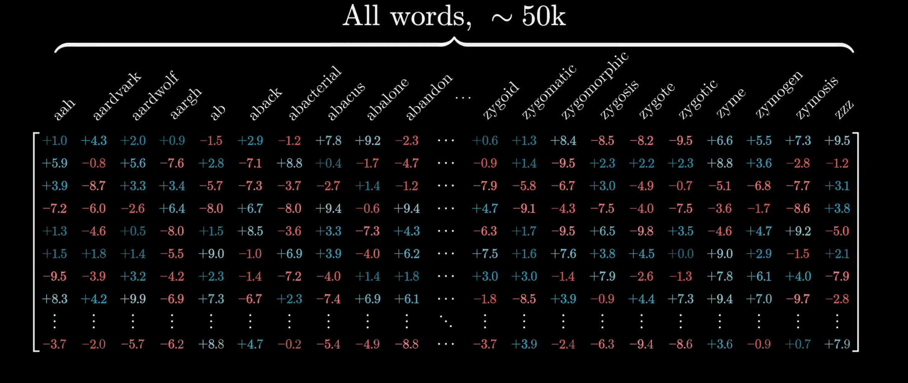
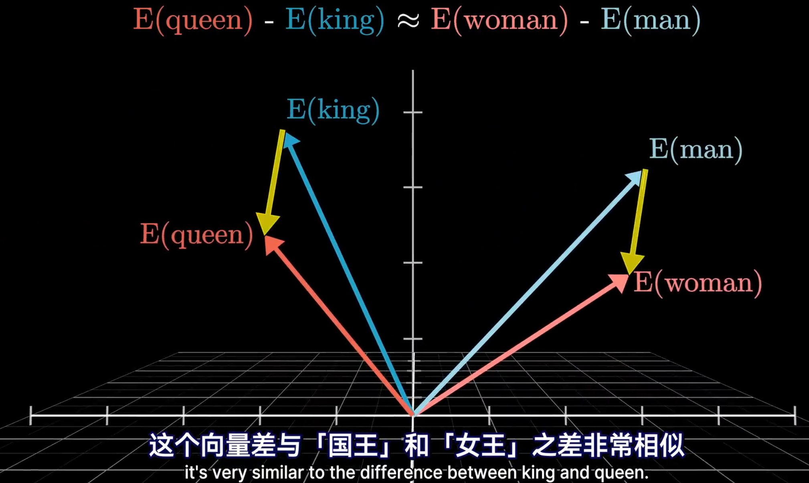
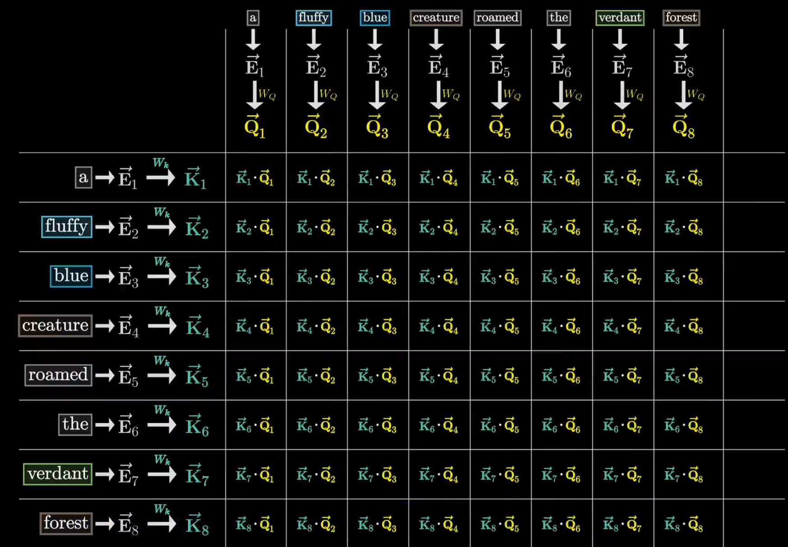
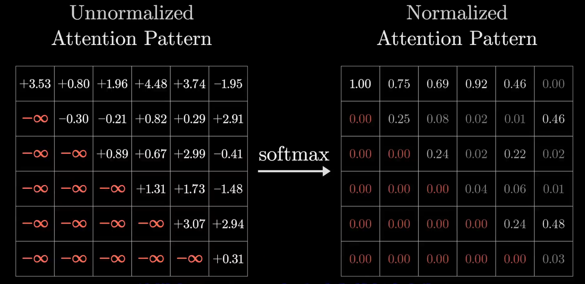
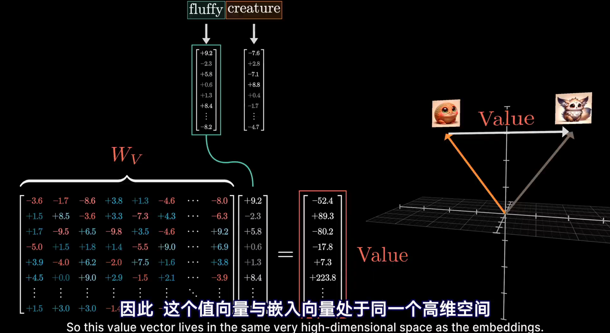
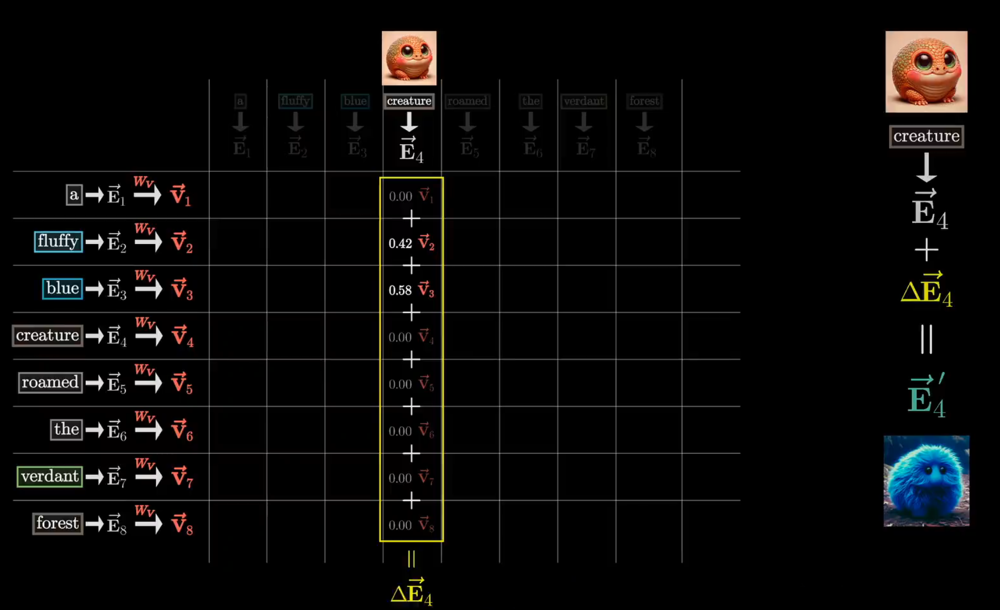
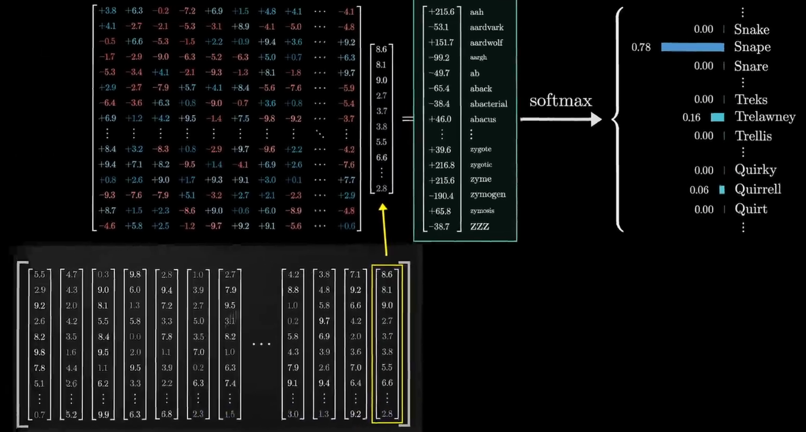
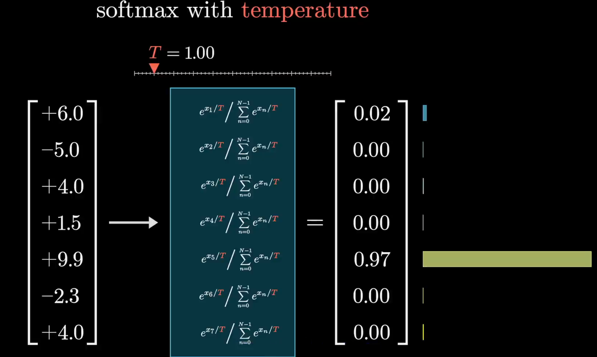
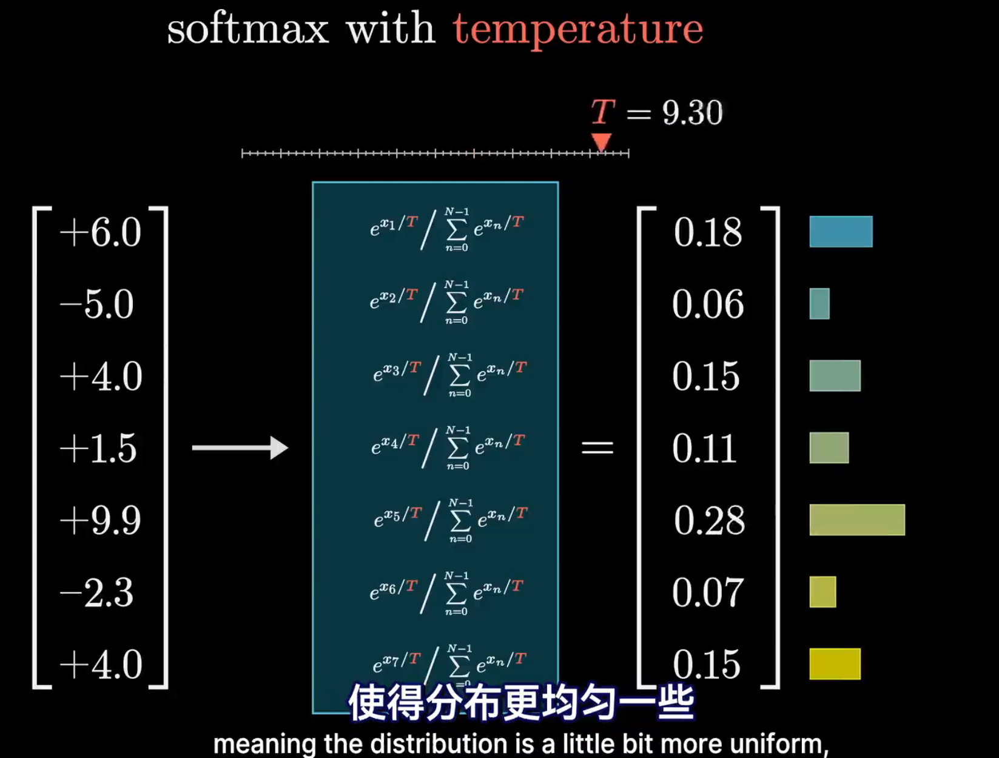

参考 [3Blue1Brown](https://space.bilibili.com/88461692/channel/seriesdetail?sid=1528929)

<!-- more -->

## GPT：Generative Pre-trained Transformer

对GPT来说，一次完整的文本生成过程中的数据流转大致分为以下几个阶段：

首先，输入内容会被切分为许多小片段，称为token，token可以是单词、单词片段、字符等。

每个token都会被映射到一个高维语义空间中的向量，这个过程称为embedding。此时的token是上下文无关的，向量只包含token本身的信息。

理所应当的，在这个高维语义空间中，语义接近的token对应的向量也会比较接近

这些向量在经过注意力机制处理后，通过相互传递信息来更新自己的值，使原先的上下文无关的token向量变得上下文相关。

经过层层处理，整段输入文字的所有关键信息都将融入到这段文字的token序列的最后一个向量中，该向量经过解码，输出为下一个token的概率分布。GPT据此产生下一个token。

GPT3总共约有1750亿个参数，绝大部分以矩阵形式存在

嵌入矩阵：$W_{e} = n_{token} \times n_{dimension} = 50257 \times 12288 \approx 6亿$

### Embedding

嵌入矩阵包含了所有token的初始向量，GPT3中共设置50257种token，每个token拥有12288个维度。

空间中的方向，将能够承载不同的语义信息

需要注意的是，GPT中的token在经注意力模块处理前还融合了该token在文本中的位置信息，即位置编码

### Attention

初始化的token携带的是原始的、上下文无关的信息，下一步就是让这些token有效的结合上下文信息，使这些向量获得比单个词汇更丰富、更具体的含义

第一步是如何让每个token注意到其他token，尤其是与自己相关的token，比如名词前的形容词，指代词指代的前面的名词等等

可以理解成，初始的token包含了该token的不同含义，现在需要对这个向量做一些处理，使它能够更好的偏移到文中含义的方向上，即对token精细化，具体化

下面是处理的具体步骤：
1. 分别使用一个(128,12288)的权重矩阵$W_{Q}$和$W_{K}$，对每一个(12288，1)的token进行左乘，得到两个(128,1)的新向量,分别为该token的query向量和key向量
    > 可以把query向量理解为该token需要了解的信息，key向量理解为该token的信息，token1的query和token2的key在空间上越接近（也就是点积越大），说明这两个向量的信息越相关

2. 每个token的query分别于上下文中其他token的key做点积，对同一个query，将其与所有key的点积结果组成一个向量，进行归一化，即代表了该token对其他token的注意力分布
    > 这就是为什么上下文token长度会成为大模型的瓶颈，这个点积计算的复杂度是$O(n^2)$，n为token长度，GPT3中的上下文长度为2048
   

3. 需要注意的是，我们不希望token注意到自己之后的token，因此在计算注意力分布时，将下半部分对应的点积结果设为负无穷，这样在softmax后，该token对后面token的注意力分布就会为0
   

4. 在得到token的注意力分布后，需要根据该分布调整目前的token，以得到更准确的token值。我们需要使用一个新的(12288,12288)的权重矩阵$W_{V}$，使用$W_{V}$左乘每个(12288，1)的token，得到一个(122888,1)的新向量，这个向量就是该token的value向量，可以理解为，value向量表示了该token对其他token的影响，当token1需要根据token2改变自己的语义时，就将token1的值加上token2的value，完成token1在语义空间上的偏移
   

5. 每一个token，都根据自己的注意力分布，去加上其他token的value值，完成自身的偏移，即完成一次注意力处理
   

6. 以上是一个单头自注意层的工作流程，注意到所需要的权重矩阵中，value矩阵的参数量远大于query和key矩阵，因此，我们一般将value矩阵低秩分解为两个小矩阵相乘，比如(12288,12288)分解为(12288,128)和(128,12288)，这样可以减少参数量，同时便于三种矩阵的存储和计算

7. 在GPT3中，一个多头自注意层拥有96个注意力头，意味着96组不同的K,Q,V矩阵，以产生96种不同的注意力模式，对每一个token来说，每一个自注意头都产生一种偏移，将这96个偏移都加到原始token上，就得到该多头自注意层的结果

> GPT3的上下文长度限制在2048个token，这意味着GPT3在处理长文本时，只能看到前2048个token的信息

### UnEmbedding

### Softmax

在对最后的token向量解码时，GPT3使用了一个softmax函数，将向量转化为下一个token的概率分布，注意到此处用到了带温度系数的softmax，用于控制输出的多样性

给指数加一个分母T，通常取值在0-10之间，显而易见当T取大值时，输出概率会给低值赋予更高的权重，使得输出多样化，反之，T取小值时，输出概率会更加集中，使得输出更加确定。T=0意味着输出概率中只有一个token的概率为1，其他token的概率为0

