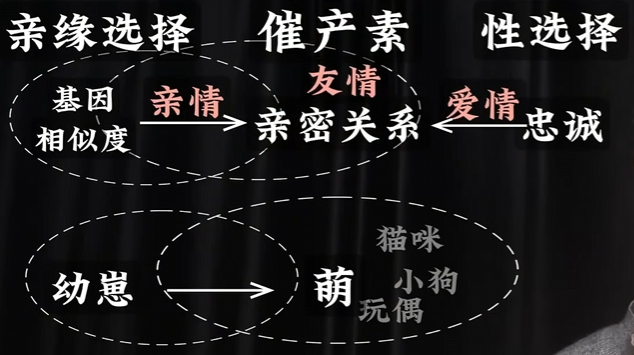

相关视频：[人性矩阵](https://www.bilibili.com/video/BV12p9gYjEkd)

## 人性本质

人性本善 vs 人性本恶：人性太复杂，根本无法用简单的二元论解释

人性最重要的维度：理性

古希腊哲学认为，人性的本质是理性的追求效用，也就是利益最大化。

弗洛伊德的人性三分：
- 本我：生物本能，原始冲动和欲望，对快感的追求
- 超我：道德约束，心中内化的社会规范
- 自我：夹在本我和超我之间的理性，平衡本我的欲望和超我的规范，达到自洽

eg：晚上刷手机，本我渴望熬夜继续获得简单的快乐；超我约束自己睡觉，不然明天迟到；自我从中调停：再玩五分钟就睡

自我是理性和权衡，给自己的行为一个满意的自我解释

亚里士多德四因说：某个事物为什么会是这个样子？如 大卫像
- 质料因：事物构成的原材料或基础 “大理石”
- 形式因：事物的本质结构 “基于大卫的造型”
- 动力因：造就事物的外部推动力 “米开朗琪罗和他的锤子”
- 目的因：事物存在的意义 “雕塑家对他心中美的表达”

人性矩阵：
|          |                  质料因                  |     形式因     |              动力因              |                 目的因                 |
| -------- | :--------------------------------------: | :------------: | :------------------------------: | :------------------------------------: |
| 对应学科 | 神经心理学：大脑结构，各类激素和神经递质 |    心智理论    | 社会心理学：记忆和群体活动的影响 | 演化心理学：探究演化过程在人身上的烙印 |
| 本我     | **各类激素（血清素、多巴胺、内啡肽等）** | **情绪和欲望** | **归属感、尊重、金钱等稀缺符号** |          **性选择、生存选择**          |
| 自我     |                 **大脑**                 |    **认知**    |           **智能选择**           |        **意识形态、共同体叙事**        |
| 超我     |       **睾酮、催产素、镜像神经元**       |    **道德**    |      **情缘选择、互惠利他**      |  **高下秩序、敌我边界、各类法律规范**  |

## 基因

NAD：人体衰老的生物学机制；三十岁后开始NAD水平下降，五十岁只有年轻时的一半

基因是身体的真正主人，对于已经淘汰掉的无数基因来说，现存的人体两万多个基因都是卷中卷

基因只有一个目标：最大化自身复制，而人体本身只是运载工具，并不重要

基因不关心个体生存（人会不可避免的走向衰老），只关心繁殖潜力

> 母爱：基因会鼓励我们牺牲自己，去帮助更有繁殖潜力的个体
> 亲情本质上的基因计算出的投资优先级，对于亲缘选择来说，根据基因相似度，越近的亲属，基因越倾向于帮助；对于繁殖潜力来说，基因影响我们更爱下一代

演化心理学对男女择偶策略的解释：

男女择偶的差异化：
- 生育成本：女性生育成本高，怀孕和哺乳需要大量时间和精力，男性则几乎忽略不计
- 确认亲生：女性可以确定孩子是自己的，但男性无法确定

男性择偶核心偏好：
- 年轻漂亮：颜值和健康是基因的直接体现，年轻意味着生育潜力大
- 忠贞：生理性保守，对女性贞洁的执着，确保孩子是自己的，基因得到延续

女性择偶核心偏好：
- 资源地位：男性的资源和地位是基因对生存和繁殖的保障
- 忠诚：心理上的依恋，代表男性对女性和后代的养育意愿

基因的反应在个体与种群的尺度上极其迟钝

人类已知最晚演化得到的基因大约7500年前出现，关于乳糖耐受

大多数哺乳动物断奶后会丧失乳糖消化能力，毕竟成年动物无需喝奶；但7500年前欧洲和非洲出现畜养奶牛和采集牛奶的行为，促进了基因突变出乳糖消化能力，并花了大约5000年在欧洲人群中普及

绝大部分基因仍然停留在采集狩猎时代：
- 男性狩猎本能演化成对篮球、足球等团体活动的热情
- 女性的采集本能演化成对购物的热情。
- 胸肌和肱二头肌等对现代社会没有太大用处，但在狩猎时代却极大影响猎手投掷标枪等的能力，因此到如今仍然是力量和性感的象征

很多现代病如痔疮、肥胖、焦虑、糖尿病等，都是基因无法适应现代生活方式的产物。

基因太慢了，无法完全靠基因本能来适应环境，因此，催生了可以临场决断的大脑，即不同于本能选择、性选择、亲缘选择的另一种选择——智能选择

## 催产素

催产素：促进分娩和哺乳的激素。增强信任、忠诚，亲密、依恋、归属感的主要来源，

下丘脑随时随地分泌催产素，温暖、幸福感的来源。可以减少皮质醇、缓解压力焦虑；可以提高血清素，使人更平静从容

催产素水平升高的情况
- 与亲密关系亲密接触：拥抱、接吻、性行为
- 萌：与婴儿、小动物接触
- 亲社会行为：帮助他人，被信任、被接纳

渣男的本质：生产素水平较低，或者体内催产素加压素受体水平较低。从硬件角度上看，并不是所有人都适合长期关系

在分娩和哺乳时，催产素的飙升会使得母亲对婴儿产生强烈的情感依恋（可爱）。演化系统为了完成这一功能，会使得人类面对大部分符合婴儿特征的生物都会激活催产素（小猫小狗）

狗狗和人类互动时，狗狗的催产素水平同样会猛增（130%）；但猫猫几乎不变：P（12%）

催产素是基因实现亲缘选择和性选择的产物：

宠物是我们养育压力更低的“幼崽”

朋友是我们可以选择的“亲人”

囚徒困境：
在设计多重策略参与两百轮囚徒困境博弈的实验中，得出最优的策略：Tit For Tat 以牙还牙
- 善良：从不主动背叛
- 报复：对方背叛一定还击
- 宽容：一旦对方改邪归正，立刻原谅，恢复合作

以牙还牙策略保证群体进入稳定的合作状态，也解释了为什么人类社会会演化出合作互惠、复仇和公平

同情心的演化：越能够理解对方，越容易建立优势。镜像神经元：人在耳闻目睹同类的悲惨遭遇后，大脑也会产生相似的痛苦感觉

而催产素能够激活镜像神经元，增强共情能力，从而更愿意帮助他人

催产素的负面效果：
- 过度信任：比如主播客服会使用的“亲亲、家人”等口语
- 非理性：催产素是高度波动的激素，无法维系长期合作。（同样的，交易感会降低催产素（谈钱伤感情））
- 加重种族歧视

催产素在人际层面可以加强感情纽带；但在群体层面，催产素会加强我们的in-group bias，也就是抱团、排外

> 在性选择中，男性可多分享并展现对婴儿、小动物的喜爱，能提升女性的好感度（演化心理学：女性天然偏好有照顾孩子意愿的男性）

加压素：男版催产素，能提高领地意识和保护性攻击

健康状况与幸福感高度相关，而幸福感只与一个因素有关：良好的亲密关系

孤独有害