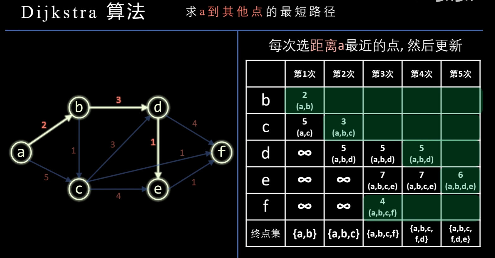
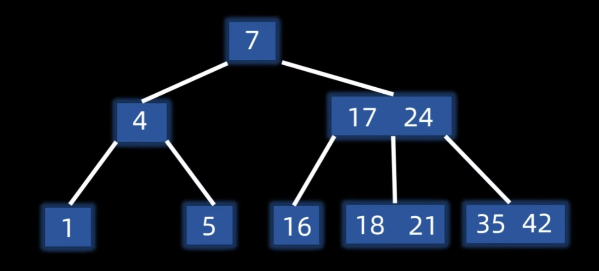

# 数据结构

## 线性表

### 顺序表

顺序表是线性表的一种实现方式，采用一段连续的存储空间来存放线性表的元素。其特点是：

- 支持随机访问，可以通过下标直接访问任意元素。
- 插入、删除、按值查找时间复杂度为T=O(n)。

表内元素逆置：遍历前半部分，与后半部分交换位置。T=O(n)，S=O(1)。

删除值为e的元素：遍历，用k统计非e元素个数，遍历时将非e元素放到第k个位置。T=O(n)，S=O(1)。

合并有序顺序表：对比两表表头元素，较小的元素放入新表，指针后移。重复此过程直到一个表为空，将另一个表剩余元素直接放入新表。T=O(n)，S=O(n)。

等长升序表A、B，求合并后新表中位数：双指针法，分别指向A、B的中间位置。比较两个指针所指元素，相等直接返回，若A[i] < B[j],则舍弃A[i]之前B[j]之后，在反复比较中间元素，直到找到中位数。T=O(n)，S=O(1)。

### 链表

删除指定节点*p：将*p的下一个节点的值赋给*p，然后删除*p的下一个节点。T=O(1)，S=O(1)。但无法删除尾节点。

删除值为e的节点：初始化pre=L,p=L->next。遍历链表，若p->data == e，则将pre->next指向p->next，删除p节点。否则同步后移pre=p，p=p->next。T=O(n)，S=O(1)。

单链表逆置：P=L->next，L->next=NULL。用P遍历L，依次将元素重新头插回L：Q=P->next，P->next=L->next，L->next=P，P=Q。直到P为空。T=O(n)，S=O(1)。

单链表找倒数第K个节点：双指针法，先让p1走K步，然后p2从头开始，p1和p2同时走，直到p1到达尾节点，此时p2所指即为倒数第K个节点。T=O(n)，S=O(1)。

判断单链表是否有环：快慢指针法，p1每次走两步，p2每次走一步，若有环则两指针必相遇。T=O(n)，S=O(1)。

循环单链表判空：L->next == L （注意L是头节点不是首节点）

循环双链表判空：L->next == L && L->prior == L

静态链表：数组存储的链式结构，每个元素包含数据域和指针域。指针域存储下一个元素的下标。静态链表的优点是节省存储空间，缺点是随机访问困难。

## 栈、队列

### 栈

一个数组+初始为-1的栈顶指针top，栈顶进栈顶出，栈顶元素为top所指元素。入栈top++，将新元素放入top位置；出栈时将top位置的元素删除，top--。

共享栈：数组Data的[0]和[maxSize-1]分别作为栈A和栈B的栈顶，两栈同时向中间生长，当A.top+1 == B.top时，栈满。入栈时先判断是否满，再将元素放入对应位置。

链栈：和单链表类似，栈顶指针指向头节点L，进栈=头插法。

### 队列

一个数组+初始为0的队头指针front和队尾指针rear。队尾进队头出，入队时rear++，将新元素放入rear位置；出队时front++，返回front位置的元素。出队后之前的空位无法再用：“假溢出”

循环队列：利用取余运算将数组逻辑上视作环。入队时 rear=(rear + 1) % maxSize，将新元素放入rear位置；出队时 front = (front + 1) % maxSize，返回front位置的元素。

但此时front==rear既可能空也可能满，我们可以少用一单元，将队满条件改为 (rear + 1) % maxSize == front。

## 串的模式匹配

主串S，模式串T，求S中满足T的子串的起始位置。

### 暴力算法

i,j分别指向S和T的起始位置，逐个字符比较。若S[i] == T[j]，则i++，j++；否则i=i-j+2（即原先位置+1），j=0。直到j==T.length时，匹配成功，返回i-j。

T=O(mn)，其中m为S长度，n为T长度。

### KMP算法

利用到之前扫面的信息，使得i不用回溯到i-j+2

匹配值（PM）：对T中每个key，分析串头到该key的子串，其最长的相同前后缀长度。PM[i]表示T[0:i]的最长相同前后缀长度。

当S[i] == T[j]时，i++，j++；否则j = PM[j-1]（即回溯到最长相同前后缀的末尾）

TBC

### 改进的KMP算法 TBC

## 树、二叉树

### 二叉树

        A
       / \
      B   C
     / \   \
    D   E   F
       /
      G

非空二叉树的叶结点数 = 度为2结点数 + 1

先序遍历——NLR：A B D E G C F

```c
void preorderRecursive(TreeNode* root) {
    if (!root) return;
    cout << root->val << " ";
    preorderRecursive(root->right);
    preorderRecursive(root->left);
}

void preorderIterative(TreeNode* root) {
    if (!root) return;
    stack<TreeNode*> st;
    st.push(root);
    TreeNode* curr = root;
    while (curr || !st.empty()) {
        while (curr) {
            cout << curr->val << " ";
            st.push(curr);
            curr = curr->left;
        }curr = st.top(); //先把所有左节点push进栈，并开始处理最左节点
        st.pop();
        curr = curr->right;
    }
}
```

中序遍历——LNR：D B G E A C F

```c
void inorderRecursive(TreeNode* root) {
    if (!root) return;
    inorderRecursive(root->left);
    cout << root->val << " ";
    inorderRecursive(root->right);
}

void inorderIterative(TreeNode* root) {
    if (!root) return;
    stack<TreeNode*> st;
    TreeNode* curr = root;
    while (curr || !st.empty()) {
        while (curr) {
            st.push(curr);
            curr = curr->left;
        }curr = st.top();
        st.pop();
        cout << curr->val << " ";
        curr = curr->right;
    }
}
```

后序遍历——LRN：D G E B F C A

```c
void postorderRecursive(TreeNode* root) {
    if (!root) return;
    postorderRecursive(root->left);
    postorderRecursive(root->right);
    cout << root->val << " ";
}

void postorderIterative(TreeNode* root) {
    if (!root) return;
    stack<TreeNode*> st;
    TreeNode* curr = root;
    TreeNode* lastVisited = nullptr;
    while (curr || !st.empty()) {
        while (curr) {
            st.push(curr);
            curr = curr->left;
        }curr = st.top();
        if (!curr->right || curr->right == lastVisited) { //如果当前节点无右子树，或右子树已经处理完
            cout << curr->val << " "; //就可以处理当前节点
            st.pop();
            lastVisited = curr;
            curr = nullptr; //同时将curr置空，等待处理下一个栈顶节点
        } else {
            curr = curr->right; //如果当前节点有右子树，要先处理右子树
        }
    }
}
```

层次遍历：A B C D E F G

```c
void levelOrder(TreeNode* root) {
    if (!root) return;
    queue<TreeNode*> q;
    q.push(root);
    while (!q.empty()) {
        TreeNode* curr = q.front(); q.pop();
        cout << curr->val << " ";
        if (curr->left) q.push(curr->left);
        if (curr->right) q.push(curr->right);
    }
}
```

先序、后序、层次任一遍历 + 中序可以唯一确定一课二叉树。因为前三者可确定根节点，中序可区分左右子树

先序 + 后序无法确定树，但可以确定结点间的祖先关系：如果先序xy，后序yx，则x一定是y祖先

### 森林

双亲表示法：类似静链表，每项附设一个游标。每个结点存储其双亲结点的下标，根结点的双亲下标为-1
| 下标: | 0 (根) | 1   | 2   | 3   | 4   | 5   | 6   |
| ----- | ------ | --- | --- | --- | --- | --- | --- |
| 数据: | A      | B   | C   | D   | E   | F   | G   |
| 双亲: | -1     | 0   | 0   | 1   | 1   | 2   | 4   |

孩子表示法：单链表数组，数组存所有节点，同时每个节点将他的孩子节点的数组下标用单链表连接起来
| 0:A | 1:B | 2:C | 3:D | 4:E | 5:F | 6:G |
| --- | --- | --- | --- | --- | --- | --- |
| →1  | →3  | →5  |     | →6  |     |     |
| →2  | →4  |     |     |     |     |     |

二叉树表示法（孩子兄弟表示法）：二叉链表，左指针指向第一个孩子节点，右指针指向第一个兄弟节点

利用二叉树表示法，可以将树和二叉树相互转化。将森林转为二叉树时，将不同树的根节点当作兄弟

### 相关应用

并查集：

- 使用双亲表示法，每个结点存储其双亲结点的下标。
- 若两个结点的双亲相同，则它们属于同一集合。
- 查找时不断向上查找双亲，直到找到游标=-1的根结点。
- 合并时将一个集合的根结点的双亲指向另一个集合的根结点。

哈夫曼树：

- n个带权节点生成的二叉树，保证其带权路径长度最小。主要用于数据压缩。
- 每个叶子结点存储一个权值，非叶子结点存储两个子树的权值之和。
- 生成哈夫曼树时，每次选择权值最小的两个节点合并成新节点，新节点的权值为两个节点权值之和。

二叉排序树（BST）：

- 二叉树的一种特殊形式，左子树节点权值 < 根节点 < 右子树的所有节点权值。使得中序遍历有序
- 插入时，若新节点小于当前节点，则递归插入左子树；否则递归插入右子树。
- 无法存在两个相等的节点
- 插入成功时节点一定在叶子节点，否则会破坏原有结构

平衡二叉树（AVL）：

- 任意节点的左子树和右子树的高度差不超过1。
- 通过旋转操作保持平衡，分为左旋、右旋、左右旋、右左旋四种情况。

红黑树（RB-Tree）：

- 一种平衡二叉排序树
- 根和叶子节点均为黑色（叶子节点一般虚拟）
- 父子不能同为红色
- 任意节点到其可到达的叶子之间都包含相同数量的黑节点
- n个节点的红黑树高度不超过2log(n+1)，因此查找、插入、删除操作时间复杂度均为O(log n)。
- 查找效率比严格的平衡二叉树稍低，但增删时不用旋转

## 图

### 存储

邻接矩阵：n个顶点，使用n\*n的二维数组存储，有边为1，无边为0

邻接表：单链表组成的数组，每个单链表表示该节点邻接的所有节点

### 遍历

```C++
vector<vector<int>> adjList;
void BFS(int start) {
    vector<bool> visited(V, false);  // 访问标记
    queue<int> q;
    q.push(start);

    while (!q.empty()) {
        int v = q.front();
        q.pop();
        visited[v] = true;
        cout << v << " ";  // 访问该节点
        // 访问所有未访问的邻接节点
        for (int neighbor : adjList[v]) {
            if (!visited[neighbor]) {
                visited[neighbor] = true;
                q.push(neighbor);
            }
        }
    }
}

void DFS(int start) {
    vector<bool> visited(V, false);  // 访问标记
    stack<int> s;
    s.push(start);

    while (!s.empty()) {
        int v = s.top();
        s.pop();
        if (!visited[v]) {
            visited[v] = true;
            cout << v << " ";  // 访问该节点
            // 将未访问的邻接节点加入栈中
            for (int neighbor : adjList[v]) {
                if (!visited[neighbor]) {
                    s.push(neighbor);
                }
            }
        }
    }
}
```

### 最小生成树

是指在一个连通无向带权图中，找到一棵包含所有顶点的树，使得所有边的权值之和最小

Prim 算法（适合稠密图）：任取一顶点加入集合，每次取距离该集合最近的点加入，T=O(|V|^2)

Kruskal 算法（适合稀疏图）：将边长排序，从小到大选择，要保证不会形成环，T=O(|E|log|E|)

### 最短路径

求图中某点到其他点的最短路径

Dijkstra算法：

简而言之，先将起点加入集合，之后每轮将加入集合的点纳入考虑并刷新路径之，再选择集合外路径最短的点加入集合，T=O(|V|^2)



Floyd算法

### 拓扑排序

以顶点表示活动的有向图（AOV网）中，每次输入一个无前驱的节点并删除它的相关边，最后生成的序列（不一定唯一）

### 关键路径

以边表示活动的有向图（AOE网）中，从源点到汇点的最长路径。路径中的边成为关键活动。

寻找关键活动：分别计算活动最早和最晚开始的时间，若时间之差<=0则该边为关键活动

缩短关键活动不一定能缩短整个工程工期，但可能会使其变为非关键

## 查找

### 二分查找

```C++
int binarySearch(const vector<int>& arr, int target) {
    int left = 0;
    int right = arr.size() - 1;

    while (left <= right) {
        int mid = left + (right - left) / 2; // 防止溢出

        if (arr[mid] == target) {
            return mid; // 找到目标，返回索引
        }
        else if (arr[mid] < target) {
            left = mid + 1; // 目标在右半部分
        }
        else {
            right = mid - 1; // 目标在左半部分
        }
    }

    return -1; // 未找到目标值
}
```

### B树



多路平衡查找树，对于一个m阶B树，每个节点最多m-1个key，m个子树

根节点最少2个子树，其他分支节点最少⌈m/2⌉个子树

所有叶子节点都在同一层且不带信息，视为查找失败

### B+树


B树的数据存在分支节点，查找到叶结点时视作失败。但B+树的数据存在叶子节点，分支节点只做索引（表示对应子树中的最大key）

对于一个m阶B树，每个节点最多m个key，m个子树

根节点最少2个子树，其他分支节点最少⌈m/2⌉个子树

叶节点包含全部key，同时按顺序排列，相邻的叶节点之间相互连接

### 哈希表

哈希函数构造方法

- 直接定址：H = a\*key+b
- 除数：H = key mod p
- SHA

处理冲突

- 开放定址：地址既对同义项开放，也对非同义项开放，这样当发生冲突书可以使用线性探测、平方探测等再次选址
- 拉链法：所有同义项按链表方式存在同一空闲地址

哈希表的查找效率取决于散列函数、冲突办法和装填因子（记录/表长）。

## 排序

| 排序算法 | 原理                                                             | 时间复杂度                         | 空间复杂度 | 稳定性 | 适合场景                               |
| -------- | ---------------------------------------------------------------- | ---------------------------------- | ---------- | ------ | -------------------------------------- |
| 插入排序 | 从头建立一个有序序列，每轮将后面的元素加入到前面的有序序列中     | 最坏/平均: O(n²), 最好: O(n)       | O(1)       | 稳定   | 小规模数据集，数据部分有序时效果好     |
| 希尔排序 | 基于插入排序的改进，将数据分组进行排序，再逐步减少分组间隔       | 最坏: O(n²), 最好: O(n log n)      | O(1)       | 不稳定 | 适用于中小规模数据，能提高插入排序效率 |
| 选择排序 | 每次选择最小（或最大）元素，与未排序部分的第一个元素交换         | O(n²)                              | O(1)       | 不稳定 | 小规模数据集，或对内存使用敏感的场景   |
| 冒泡排序 | 重复比较相邻元素，并交换它们的位置，将最大的元素“冒泡”到末尾     | 最坏/平均: O(n²), 最好: O(n)       | O(1)       | 稳定   | 小规模数据集，或对效率要求不高的场景   |
| 快速排序 | 分治法：选取一个基准元素，将小于基准的元素放左边，较大的放右边   | 最坏: O(n²), 最好/平均: O(n log n) | O(log n)   | 不稳定 | 大规模数据集，平均性能优秀，内存消耗小 |
| 堆排序   | 将数据构建成堆结构（通常是最大堆），然后反复取出最大元素并调整堆 | O(n log n)                         | O(1)       | 不稳定 | 适用于需要优先队列的场景，如调度算法   |
| 归并排序 | 分治法：递归地将数组分割成两半，再合并两个已排序的子数组         | O(n log n)                         | O(n)       | 稳定   | 大规模数据集，特别是外部排序           |
| 基数排序 | 按位数进行排序，逐位比较，通常与计数排序结合使用                 | O(nk), k为位数                     | O(n + k)   | 稳定   | 数据范围较小且均匀分布的整数或字符串   |
| 桶排序   | 将数据分到有限数量的桶中，再对每个桶中的数据进行排序             | 最坏: O(n²), 最好: O(n + k)        | O(n + k)   | 稳定   | 数据范围已知且分布均匀的场景，如浮点数 |

```C++
void insertionSort(vector<int> &nums) {
    // 外循环：已排序区间[0, i-1]，待排序nums[i]
    for (int i = 1; i < nums.size(); i++) {
        int curr = nums[i],
        int j = i - 1;
        // 内循环：将 curr 插入到已排序区间 [0, i-1] 中的正确位置
        while (j >= 0 && nums[j] > curr) {
            nums[j + 1] = nums[j]; // 将 nums[j] 向右移动一位
            j--;
        }
        nums[j + 1] = curr; // 将 curr 赋值到正确位置
    }
}

void selectionSort(vector<int> &nums) {
    int n = nums.size();
    // 外循环：已排序区间[0,i-1]，待排序nums[i]
    for (int i = 0; i < n; i++) {
        // 内循环：找到未排序区间内的最小元素
        int minIndex = i;
        for (int j = i + 1; j < n; j++) {
            if (nums[j] < nums[minIndex])
                minIndex = j; // 记录最小元素的索引
        }
        // 将该最小元素与未排序区间的首个元素交换
        swap(nums[i], nums[minIndex]);
    }
}

void bubbleSort(vector<int> &nums) {
    int n = nums.size();
    // 外循环：未排序区间[i,n-1]，每次从右往左冒泡以修复nums[i]
    for (int i = 0; i < n; i++) {
        // 内循环：将未排序区间 [i, n-1] 中的最小元素交换至该区间的最左端
        for (int j = n - 1; j > i; j--) {
            if (nums[j] < nums[j - 1]) {
                // 交换 nums[j] 与 nums[j - 1]
                swap(nums[j], nums[j - 1]);
            }
        }
    }
}

```


# 计算机组成原理

## 系统概述

冯诺依曼架构：
- 硬件系统：运算器 + 控制器 + 存储器 + 输入设备 + 输出设备
- 指令和数据同等地位存储在存储器中，按地址寻访，均为二进制
- 指令由操作码和地址码组成
- 指令在存储器中顺序存放，机器在指令驱动下自动执行

系统多级层次：
1. 硬联逻辑级，由门电路、触发器等逻辑电路构成
2. 微程序级，由微指令编写微程序，控制信息传送
3. 机器语言级：用微程序解释机器指令系统
4. 操作系统层
5. 汇编语言层
6. 高级语言层
7. 应用语言层

## 数据的表示和运算

## 存储器结构层次

### 分类

按作用分类
- cache：与CPU速度匹配，通常在CPU内
- 主存：内存，CPU可直接随机访问，并且可与cache、辅存交换信息
- 辅存：外存，不可与CPU直接交换数据

cache和内存间的交换由硬件自动完成，内存和外存间的交换由硬件和操作系统实现

按存取方式分类：
- 随机存储：RAM，存取时间与物理地址无关
- 只读存储：ROM，狭义上的只能随机读不能写，现在代表可以随机存取，但写入会慢几个数量级，且断电保留
- 串行访问：如CD等，不可随机存取，要按照物理地址的先后寻址

### 高速缓冲存储器 Cache

局部性原理：
- 时间局部性：最近的未来要用的信息，很可能是现在正使用的信息
- 空间局部性：最近的未来要用的信息，很可能与现在正使用的信息物理上相邻

一致性和包容性原则：
- 一致性：多级存储体系中，同一信息可能同时存放在几个存储层次中，信息在这些层次中必须相同
- 包容性：内层信息一定被包含在各级外层存储器中

基于以上原理，cache将内存中频繁使用的数据复制，每次要使用时，若能直接在cache中找到，则可以极大提高效率。对于未找到的，在内存中访问完后立即调入cache

cache和内存的映射方式：
- 直接映射：根据内存块的地址以及cache块号，每个内存块装入cache的块号是唯一确定的，若该cache块已经存了其他内存块，则直接替换
- 全相联映射：每一个内存块可以装入任意一个cache块，CPU访存时需要检查cache中所有块以确定是否命中
- 组相联映射：将cache空间分组，组间使用直接映射，组内全相联，相当于上述两个方法的折中

cache替换算法：（直接映射直接替换，算法主要针对全相联和组相联）
- RAND：随即替换
- FIFO：选择最早调入的cache块进行替换
- LRU：近期最长时间未使用的块进行替换
- LFU：最不经常使用的块进行替换（不如LRU）

cache写策略：CPU对cache命中后，需修改命中的这块内容，如何保证这块内容在cache和内外存中的一致性
- 全写法：同时写入cache和内存对应块
- 写回法：只修改cache，当该cache块要被替换时再写回内存

### 虚拟存储器

为了弥补内存空间的不足，将外存在逻辑上当作内存的地址空间，以虚地址形式访问。由辅助的软硬件将虚地址转换为外存的实际物理地址。

#### 段式虚存
将程序的存储按功能划分为相对独立的段，以段为单位进行内外存之间的调度。

使用段表指明每个段的段号、装入位（是否装入内存）、段起点、段长、访问方式等信息

分段一般与程序的自然分界对应，具有逻辑独立性，便于编译、共享。

但不固定的段长也不便内存分配空间，会造成内存碎片。

#### 页式存储

以固定长度的页面为基本单位，将内存和虚存都划分成固定大小的页。

虚拟地址可分为虚页号 + 页内地址两个字段，由页表实现从虚地址到实地址的转换

页表位于内存中，存放虚页号与实页号的映射，指明装入位、脏位（写回机制）、引用位、物理地址等。

CPU的指令中是虚拟地址。执行指令时：
1. 根据每个进程的页表基址寄存器找到该进程的页表首地址
2. 根据虚拟地址的高位（也就是虚页号）在页表中找到对应的页表项
3. 若该页表项的装入位为1，代表该页已经装入内存。此时根据页表项对应的实页号，再加上虚拟地址的低位（页内地址）找到实际的物理地址
4. 若该页表项装入位为0，代表该页还未装入内存，需要操作系统进行缺页处理

在上述机制中，每次访存都需要查一次页表，增加了访问主存的次数。系统引入了基于局部性原理的快表机制（TLB），类似cache，将满足局部性的页存在TLB中，提高访存效率

## 指令系统

### 指令格式
一组二进制代码，分为操作码字段和地址码字段
1. 零地址指令：只有操作码OP，没有显式地址，如空操作、停机、关中断指令等
2. 一地址指令：操作码OP + 地址码A1，按A1地址取出数据进行OP操作后再放回原地址，如+1、-1、求反等
3. 多地址指令：OP + A1 + A2 +。。。

### 寻址方式

#### 指令寻址：找下一条将执行的指令的地址
一般由程序计数器PC给出。

顺序寻址时，每执行一次指令PC自动+1（指一条指令占的地址长度，如指令长2B，则按字节编址就是+2）

对于变长指令，CPU会先读一个字节，根据OP码判断指令长度并据此修改PC值

需要转移类指令时，会根据当前操作数（跳转）修改PC值

#### 数据寻址：确定本指令地址码的真实地址

数据寻址方式较多，通常在指令中设一字段指明采用哪种寻址方式，如 OP + 寻址特征 + 形式地址A1 + 寻址特征 + 形式地址A2 。。。

- 直接寻址：形式地址A就是逻辑地址EA，即EA = A
- 间接寻址：A指向的单元中存放了EA的地址，即 EA = (A)，类似指针，可以多次间址
- 寄存器寻址：A是寄存器的地址EA = R
- 寄存器间接寻址：A是寄存器地址，但存储的是逻辑地址，EA = (R)
- 立即数寻址：A就是操作数本身，一般是补码形式
- 基址寻址：基址寄存器BR中的内容 + A 才是逻辑地址，EA = (BR) + A，一般来说 (BR) 不可变
- 变址寻址：变址寄存器IX的内容 + A，即 EA = (IX) + A，一般来说 (IX) 作为偏移量可变，而A不变
- 相对寻址：A是下一条指令位置的偏移量，即 EA =  (PC) + A，一般用于跳转指令
- 隐含寻址：一些特殊指令如ADD，隐含的规定的ACC寄存器作为第二操作数地址

### 指令集

CISC：复杂指令集，包含指令条目多，功能覆盖广，指令长度可变，寻址方式多样，一般采用微程序实现，如x86架构

RISC：根据使用频率，只选择最经常用的简单指令，其他功能依靠指令间的组合实现。指令长度固定、格式单一，如arm架构

## 中央处理器

### 功能和结构

功能：指令控制、操作控制、时间控制、数据加工、中断处理

基本结构：
- 运算器：数据加工的中心，由算术逻辑单元ALU、暂存寄存器、累加器ACC、通用寄存器组、状态寄存器PSW、移位器、计数器CT组成
- 控制器：
  - PC：程序计数器，存放下一条指令的内存地址，有自增功能
  - IR：指令寄存器，保存当前执行的指令
  - ID：指令译码器，将指令的OP字段送至ID，提供特定的操作信号
  - MAR：内存地址寄存器，存放指令需要访问的内存地址
  - MDR：内存数据寄存器，存放向主存读或者写的信息
  - 时序系统：产生时序信号
  - 微操作信号发生器：根据(IR)、(PSW)以及时序信号，产生控制信号

### 指令执行过程

指令周期：CPU取出并执行完毕一条指令的时间，通常由若干机器周期组成，如 取指令 + 取有效地址 + 执行指令 + 等待中断。这些指令周期又包含若干时钟周期

一个完整的指令周期一般包括：取指周期 + 间指周期 + 执行周期 + 中断周期

为了区别不同周期，CPU内置4个标志触发器，FE、IND、EX、INT，分别对应上述四个周期

#### 取指周期：根据PC的内容从内存中取出指令并放入IR

1. 将PC的内容保存至MAR，MAR在将地址通过地址总线传给内存：(PC) -> MAR -> 地址总线 -> 内存
2. CU通过控制总线将读信号发给内存： CU：(1->R) -> 控制总线 -> 内存
3. 内存通过数据总线，将相应地址的内容传给MDR，再交给IR： 内存 -> 数据总线 -> MDR -> IR
4. CU发出控制信号，使PC+‘1’：(PC) + 1

#### 间指周期：取得操作数的有效地址

1. 将指令中的地址码送给MAR，再经MAR转发给内存：Ad(IR) 或 Ad(MDR) -> MAR -> 地址总线 -> 内存
2. CU发出读信号给内存：CU：(1->R) -> 控制总线 -> 内存
3. 内存通过数据总线，将有效地址存到MDR：内存 -> 数据总线 -> MDR

#### 执行周期：取操作数，根据IR中的指令操作码，通过ALU产生执行结果

#### 中断周期：暂停当前任务，保存断点并处理中断，一般使用堆栈
假设使用SP指示栈顶地址，由于计算机中的堆栈是向低地址增加，所以进栈操作是SP-1

1. CU控制SP-1，并传给MAR，再通过地址总线传给内存： SP-1，(SP) -> MAR -> 地址总线 -> 内存
2. CU发出写命令，并通过控制总线传给内存： CU：(1->W) -> 控制总线 -> 内存
3. 将PC中的信息写进内存的地址为SP的单元中： (PC) -> MDR -> 数据总线 -> 内存
4. CU将中断服务的入口地址传给PC：CU -> PC

## 指令流水

## 总线

## IO

# 操作系统

## 系统概述

### CPU运行级别

内核程序：管理者，可执行除trap之外的所有指令，常见特权指令如IO、中断。内核程序在核心态执行
应用程序：用户自编程序，此时CPU处于用户态，无法执行特权指令

内核态 -> 用户态：执行中断返回指令，该指令修改PSW，修改CPU状态
用户态 -> 内核态：通过中断信号，OS进入内核态，停止当前应用程序，转而执行中断处理程序

### 中断和异常

异常（内中断）：来自CPU内部，与当前指令有关
- 陷入：Trap，应用程序在请求内核服务时，会加入一条Trap指令，进而引发中断处理，将控制权转给内核以进行内核服务
- 故障：Fault，一些错误条件导致（如缺页故障），内核修复故障后会交换用户程序继续执行
- 终止：Abort，一些致命错误（如除0，非法使用特权指令），内核会直接终止当前程序

中断（外中断）：来自CPU外部设备，CPU在每个CLK的末尾进行检查
- 时钟中断：任务的时间片已到，由时钟部件发出，CPU交由处理时钟中断的内核程序处理
- I/O中断：外部设备发出的信号，CPU同理交由相应内核程序处理

外中断处理流程：
1. 关中断：硬件级别。CPU响应中断后，保护现场，不再响应其他更高级中断
2. 保存断点：硬件级别。保存原先程序的(PC)
3. 中断服务程序寻址：硬件级别。查询中断向量表（由OS初始化），确定相应的中断服务程序，将其入口地址传给PC
4. 保存现场和屏蔽字：软件级别。保存PSW和某些通用REG的内容
5. 开中断：硬件级别。此时允许响应更高级的中断
6. 执行中断服务程序
7. 关中断：硬件级别。准备恢复现场，恢复的过程也不能相应其他中断。
8. 恢复现场和屏蔽字。
9. 开中断，中断返回

### 系统调用
广义上的指令，是OS提供给应用程序使用的接口，应用程序可以执行Trap发起系统调用，请求OS内核服务，OS转为核心态提供相应处理后在返回用户态

凡是与共享资源有关的操作，都需要应用程序访管，交由OS处理，如设备管理、文件管理、进程控制、进程通信、内存管理等

## 进程管理

### 基本
进程是程序的一次执行过程，是OS进行资源分配和调度的独立单位，动态

进程映像 = PCB + 可共享程序段 + 数据段 ，反应进程某个时刻的状态，静态

进程控制块PCB
- PID：独一无二的进程ID，属于用户ID下
- 进程控制和管理信息：包括CPU、磁盘等资源使用情况，进程当前状态等
- 资源分配清单：显示正在使用的文件、内存区、IO设备等
- 处理机相关信息：PSW、PC等Reg值，用于进程切换

进程状态：
- 创建态：OS为新进程分配PID，并申请PCB，然后为进程分配资源（分配成功则就绪，资源不足则阻塞）
- 就绪态：进程获得除CPU外的一切所需资源，处于就绪队列，等待上CPU
- 阻塞态：进程因等待某事件而暂停，如等待非CPU资源，IO完成等，此时及时CPU空闲也无法运行，位于阻塞队列
- 运行态：正在CPU上运行的进程
- 挂起态：位于就绪态或阻塞态是，进程可能暂时被调到外存等待

进程状态转换：
创建态 --> 就绪态 <--> 运行态 --> 终止态
- 就绪 -> 运行：进程被OS调度上CPU
- 运行 -> 就绪：时间片已到或CPU被抢占
- 运行 -> 阻塞：进程使用系统调用申请某资源或等待某事件
- 阻塞 -> 就绪：申请的资源被分配，或等待的事件已发生

### 进程通信IPC
进程是资源分配的单元，各进程间的内存空间相互独立，无法直接访问其他进程的地址空间

- 共享存储：OS在内存中划分一块共享存储，通过互斥操作实现各进程对共享空间的RW。
- 消息传递：
  - 直接通信：指明接收进程PID，通过发送原语直接传递信息，会挂到目标进程的消息队列上等待接收
  - 间接通信：发送到某中间实体（信箱），接收方从信箱中接收
- 管道通信：Pipe，内存中一片固定的缓冲区，单Pipe半双工，双Pipe全双工。OS控制Pipe的互斥访问，管道写满时则写进程阻塞，读空时则读进程阻塞


### 线程

线程是CPU的基本执行单元，程序执行流的最小单位，引入线程使得进程内部也可并发

进程是OS资源分配的基本单元，线程是CPU资源分配的基本单元。

每个线程有一线程ID和线程控制块TCB，几乎不拥有系统资源，只是在运行时共享所属进程的资源。

同进程的线程切换开销很小，由于共享地址空间，同进程的线程通信甚至无需OS干预

线程实现：
- 用户级线程：ULT，线程管理的所有工作由应用程序完成，内核意识不到现成的存在，进程内的线程切换在用户态下，同时一个线程阻塞，整个进程都阻塞，且多个线程无法上多核CPU并行。
- 内核级线程：KLT，真线程。线程管理由OS完成，程序只有到内核线程的编程接口，OS通过TCB管理线程。线程切换需要变态，一个KLT阻塞，其他KLT不受影响。

### 处理器调度

调度层次：
- 作业调度：按照规则将合适作业调度内存，并为其创建相应进程。相当于 无 -> 创建态 -> 就绪态
- 内存调度：从进程的挂起队列中选择合适进程调回内存，相当于 挂起态 -> 就绪态
- 进程调度：从进程的就绪队列中选择合适进程上CPU，相当于 就绪态 -> 运行态

调度算法：
- FCFS：先来先服务。排队式，非抢占，不会导致饥饿。
  - 对长作业有利，短作业不利
- SPF：短作业优先。每次调度选择队列中需CPU时间最短的进程上机。
  - 非抢占，会导致饥饿。短作业有利
- SRTN：最短剩余时间优先。SPF的抢占式版本
- HRRN：高响应比优先。每次调度时计算各进程或作业的响应比（(等待时间+所需时间)/所需时间）
  - 非抢占，不会饥饿，对短作业有利
- RR：时间片轮转，抢占式，不会饥饿
- 优先级调度
- 多级反馈调度：设多个队列，优先级依次降低，时间片依次增大，上级队列空闲时才允许处理下级队列。
  - 各队列FCFS，新进程加入最高级队列的队尾，若经过高级队列处理未处理完，则加入低级队列队尾。
  - 被抢占的进程放回原队列队尾。
  - 会导致饥饿（如果源源不断有进程加入，则低级队列得不到处理）

### 进程同步

同步的主要任务：约束并发带来的异步性，让程序的执行具有可再现性

互斥准则：空闲让进、忙则等待、有限等待、让权等待（不能进临界区则放弃CPU）

互斥的软件实现：
- 单标志法：设置一个公用变量turn，指示允许进入临界区的进程ID。进程使用完后再修改turn让给其他进程。
  - 谦让算法，违背了“空闲让进、让权等待”
- 双标志先检查法：设一布尔数组，标志各进程是否在用临界区。进程进入前先检查数组的其他值，若有true则等待，若全false则将自身flag标为true并进入，用完后改为false。
  - 检查和上锁并非一气呵成，可能同时进入临界区，违背“忙则等待、让权等待”
- 双标志后检查法：先将自己的flag设为true，在检查其他flag。
  - 同样，如果两个进程同时设true，则都进不了。违背“空闲让进、有限等待、让权等待”
- Peterson算法：既设置flag数组又设置turn标志。进程先将自身flag设为true，再将turn设为对方，并检查若对方flag=1且turn=对方则等待，否则进入临界区
  - 用flag表意愿，用turn表谦让，但仍然违背 让权等待

互斥的硬件实现：
- 中断屏蔽：用开/关中断指令实现，但不适合多处理机，并且只能用于内核级进程（交给用户太危险）
- TSL指令：检查上锁状态，无论是否已上锁，再上锁，返回原来状态，即 while(TestAndSet(&lock)) ，若原先上锁，则空等；若未上锁，则上锁并进入
- Swap指令：略了，上述硬件实现也都不满足让权等待

信号量机制：信号量指OS中该类资源数量的变量，初始为数量，通过一对PV原语控制
- 整型信号量：消耗资源时用wait（等待信号量S。若S>0则-1，标志将使用一个资源），使用完毕后用signal（S++）
    - 互斥的实现：设置互斥信号量mutex=1即可
    - 同步的实现：设置同步信号量S=0；在需要后执行的代码前加入P(S)，需要先执行的代码后加入V(S)，这样只有V(S)执行后，P(S)才通过

经典同步问题：
1. 生产者-消费者
    - 一组生产者进程和一组消费者进程共享一初始为空，大小为n的缓冲区
    - mutex=1用于互斥访问，full=0记录缓冲区使用的数量，empty=n记录空区数量
    - 生产者：P(empty) -> P(mutex) -> 生产 -> V(mutex) -> V(full)
    - 消费者：P(full) -> P(mutex) -> 消费 -> V(mutex) -> V(empty)
2. 吸烟者：生产者生产多种产品 多消费者
    - 生产者生产材料，对应的消费者消费并提示生产者继续生产
    - Offer1=0、Offer2=0、Offer3=0 对应生产者产出材料；finish=0 标志消费者的完成信号
    - 生产者：生产 -> V(相应Offer) -> P(finish)
    - 消费者1：P(Offer1) -> 消费 -> V(finish)
3. 读者-写者
    - 一组读者和一组写者共享一个文件
    - 互斥：rw=1标志写者的互斥访问；count=0记录正在读的数量；mutex=0保证对count的互斥
    - 读优先：只要有读就无法写：


管程：一种高级同步机制，使得程序员不用再关注复杂的PV操作，而是将共享资源的操作封装，每次仅允许一个进程进入

### 死锁

死锁的必要条件：
- 互斥：进程对互斥资源的争抢
- 不剥夺：进程所获资源在未使用完毕前，不得被其他资源抢夺
- 请求并保持：进程保持资源的情况下，又提出新的资源请求。由于该资源被占用不得不阻塞，但又对已有资源保持不放
- 循环等待：存在进程资源的循环等待链
  - 死锁一定有循环等待，但循环等待不一定死锁（除非每类资源都只有一个）

死锁预防：
- 破坏互斥条件：将互斥资源资源改造成允许共享
- 破坏不剥夺条件：
  - 进程请求资源无法满足时，立即释放现有资源
  - 所需资源被占用时，由OS协助强行剥夺
- 破坏请求和保持条件：静态分配，运行前申请所需全部资源，未满足则不运行。但这会导致资源利用率低，导致饥饿
- 破环循环等待条件：顺序资源分配，给资源种类编号，规定进程只能按照顺序申请资源，且同类资源一次性申请完。会导致资源浪费

避免死锁：银行家算法
- 允许进程动态申请资源，但每次分配前计算分配安全性，安全则分配，不安全则等待
    - 安全状态指OS的剩余资源可以按照某顺序一次满足进程的需求，从而使每个进程都可以完成
- 算法：n个进程，m种资源，设置各进程最大需求量Max矩阵(n\*m)和已分配矩阵Alloc(n\*m)，以及Need = Max - Alloc
  - 对于某进程的一次申请，判断是否在他需要的范围内 Request <= Need
  - 接着判断系统是否可以满足申请
  - 接着尝试分配并执行安全性算法，若都满足则分配，否则阻塞

死锁解除：
- 资源剥夺：挂起某些死锁进程，将其资源分配给其他资源
- 撤销进程：按优先级和代价强制撤销某些死锁进程
- 进程回退：让某些进程回退到足以避免思索地地步

## 内存管理

程序装入步骤：
- 编译：由源代码生成目标模块
- 链接：由目标模块生成装入模块，链接以形成完整的逻辑地址
- 装入：将装入模块装入内存，有了物理地址


### 页式存储

将内存分成大小相等的页框（页帧、物理页、块），从0开始编号，将进程页分为同样大小的分区，称为页。OS以页框为单位为各进程分配内存，每个页对应一个页框，不用连续存放。

OS会为每个进程建立一张页表（在进程的PCB中），其中每个页表项包含页号和页框号的对应关系（页号隐含）

确定物理地址：
1. 通过逻辑地址得到该地址所在的页号以及页内偏移
2. 查页表，通过页号得到页框号
3. 通过页框号得到块地址，加上页内偏移得物理地址

地址转换机构：
- 页表寄存器PTR：OS使用PTR存放页表在内存中的起始地址F和表长M，当某进程被CPU调度时，就从它的PCB中得到F和M放入PTR。对于逻辑地址A，首先根据OS设置的页大小（假设为2^n bit）就可知A的后n位为页内偏移，前面的都是页号。
- 快表TLB：一种cache，集成在CPU内部，用于存放最近访问的页表项副本，通过时空局部性加快地址变换速度。TLB命中时，可以直接得到物理地址，节省了访问页表的一次访存开销。
- 多级页表：通常页表在内存中以连续块存放。但页表太大时，也可以将页表分组装入页框，为离散的页表再建一张页表。

### 虚拟内存
根据局部性原理，作业无需一次性调入内存就可以运行，并且运行时也无需常驻内存，可以多次换进换出。因此可以在逻辑上扩充内存，使用户看到的容量远大于实际。逻辑地址对应的内容不一定可以直接在内存中找到，也许还需要从外存中调进来。

请求分页管理方式：在分页基础上，页表项中增添一些列
- 状态位：表示该页是否在内存中（如果不在，页表项中的物理页框号也没有意义）
- 访问字段：最近访问次数或上次访问时间等，共置换算法参考
- 修改位：该页调入内存后是否被修改过
- 外存地址

缺页中断：
OS根据逻辑地址找到页表项后首先会检查状态位，若不在内存中则引发缺页中断。中断处理会将目标页调入内存并修改相应页表项。一个指令可能会产生多次缺页中断。

页面置换算法：
- 最佳置换：换出将在最长时间不再被使用的页。只是理论上，无法实现。
- 先进先出FIFO：会导致belady异常————有时候增加物理块反而会让缺页率不降反升（因为FIFO完全不考虑页面的访问频率或最近访问时间）
- 最近最久未使用LRU：经典手撕，双链表+hash
- 时钟置换NRU

驻留集：OS给一个进程分配的物理块的集合。驻留集太小会导致频繁缺页（抖动），太大会降低程序的并发度。

工作集：某时间窗口内进程实际访问物理块的集合。

## 文件管理

文件本身结构：
- 无结构：又称流式文件，以字节为单位顺序组织成记录并积累。如txt、exe、png、mp4、c源代码。对记录的访问只能穷举搜索。
- 顺序文件：记录按照时间或关键字的顺序排列。如早期的工资单文件。
- 索引文件：建立一张索引表加快检索。如图书馆数目索引。

文件目录结构：

# 计算机网络

## 概述

网络性能指标
- 发送时延：传输时延，分度的第一个比特开始推送到最后一个比特推送完毕的时间，t =  数据长度 / 发送速率
- 传播时延：比特在信道中的传播时间，t = 信道长度 / 点播在信道中的速率
- 处理时延：节点为存储转发进行的必要处理时间（检错、找出口等）
- 排队时延：节点在路由I/O口排队的时间
- 时延带宽积：传播时延 * 信道带宽
- 往返时延RTT：从发送数据完毕到接受确认信息的时间（不包括发送时延），RTT = 2 * 传播时延 + 末端处理时间

网络分层模型：每层拥有各自的协议数据单元PDU，由服务数据SDU + 协议数据PCI组成。SDU就是上层的PDU，加入本层的PCI之后，交给下层。层层传递直到物理层

OSI7层参考模型：自上而下
- 应用层：用户使用的应用程序接口
- 表示层：两系统间数据格式转换、加密解密
- 会话层：建立、管理和终止会话
- 传输层：PDU——报文段（TCP）或数据报（UDP）
  - 提供端到端的可靠传输，差错控制、流量控制等功能
  - 协议：TCP、UDP
- 网络层：PDU——数据报
  - 将数据报分组从源端点对点地传到目的端，为不同主机提供通信服务
  - 协议：IP、ICMP、ARP、OSPF
- 数据链路层：PDU——帧
  - 将网络层传来的IP数据报封装成帧，提供差错控制，流量控制、信道访问控制等
  - 协议：SDLC、HDLC、PPP、STP
- 物理层：PDU——比特流
  - 负责比特流的透明传输
  - 协议：一般成为接口标准，如RJ45、IEEE802.3等，主要规定电路接口参数、传输信号意义、电气特征等

实际TCP/IP四层模型：
- 应用层：OSI上三层
- 传输层：TCP + UDP
- 网际层：IP
- 网络接口层：OSI下两层

## 物理层

### 通信基础

码元：固定时长的信号波，代表不同离散数值的基本波形

波特率：单位时间码元的传递个数

奈奎斯特定理：波特率存在上限，在理想低通，带宽为W（hz）时，波特率最大为2W，否则会出现码间串扰。

香农定理：在带宽受限且存在噪声干扰的信道中，比特率有上限
- 信噪比： S/N = 10lg(Ps/Pn)，其中Ps为信号功率，Pn为噪声功率
- 最大比特率： C = W * log2(S/N)

### 编码

### 物理层设备

中继器：对数字信号做还原再生，回复线路中的损耗，以增强传输距离。仅作用于信号，不对数据包进行分析或处理。

集线器：多端口中继器，一个I口，多个O口，不具备定向能力，多个O口平分带宽（因为一个clk仍然只传一组数据）


## 数据链路层

### 功能
为网络层提供服务
- 无确认的无链接服务：丢失帧后DLL并不负责而是交由上层
- 有确认的无链接服务：无线通讯
- 有确认的面向连接服务

透明传输：将上层数据包封装成帧（添加首部和尾部）透明传输（无论什么样的比特组合，对DLL来说都是透明的），需要帧定界和同步功能
- 字符计数法：首部使用第一个字节标明帧内字节数
- 字符填充法：声明SOH（00000001）和EOT（00000100）标志帧的开始和结束
- 零比特填充法：用01111110标志开始和结束，在数据中插入额外的零比特，以避免特定比特模式的出现

差错控制（零比特差错） 当然，随着网络发展，目前已不再需要DLL提供差错控制功能
- 检错码
  - 奇偶校验码
  - 循环冗余码
- 纠错码
  - 海明码

流量控制和可靠传输：DLL基于控制相邻节点间的应答，进行流量控制
- 停止等待协议：发送窗口和接收窗口均为1。发送方发送一帧后等待接收方的确认，收到确认后再发送下一帧，802.11
- 后退N帧协议：发送窗口 > 1，接收窗口 = 1。发送方可以在等待确认的同时发送多帧，但接收方只能按顺序接收，遇到有一帧超时，后面的帧全部重传
- 选择重传协议：发送窗口和接收窗口均 > 1。发送方可以在等待确认的同时发送多帧，接收方可以对收到的帧进行确认，未收到的帧可以选择性重传

介质访问控制MAC：对使用介质的每个节点隔离来自同一信道的其他信号
- 划分信道：包括频分复用、时分复用、码分复用等
- 随机访问划分：
  - ALOHA协议：不做任何处理，若超时就认定信道中发生冲突，等待随机时间后再重传
  - CSMA协议：载波侦听，发前检测信道是否空闲，忙则等待
  - CSMA/CD：加入碰撞检测的载波侦听，在CSMA的基础上边发送边侦听。如果信号在总线的单程传播时延为τ，则至多2τ内就能确定信息是否碰撞（争用期）。节点必须在发送完之前得知是否发生碰撞，若发生则停止发送，等待随机时间后重传。因此每帧的发送时间 > 2τ，据此可求得最小帧长。
  - CSMA/CA：加入碰撞避免的载波侦听。多适用于无线网络。
- 轮询访问：令牌环网

### 局域网

广播信道、范围小、速率高、延迟低、可靠性强

以太网：总线型、CRC检测、CSMA/CD
- 以MAC帧作为以太网在DLL的PDU

802.11无线局域网：星型、CSMA/CA

### 广域网

范围广、点对点、分组交换

PPP协议：不可靠，通过拨号或专线进行点对点传输

HDLC：可靠，面向比特的协议，提供帧的封装、差错检测和恢复等功能

### DLL设备

网桥：根据MAC帧地址对帧进行转发和过滤，可以隔离冲突域，提高吞吐量

交换机：自学习的多接口网桥，可以隔离冲突域，仍然无法隔离广播域

