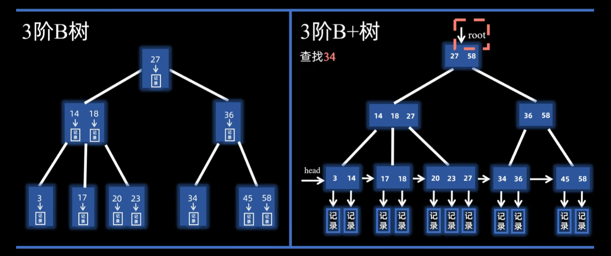

# 数据结构

## 线性表

### 顺序表

顺序表是线性表的一种实现方式，采用一段连续的存储空间来存放线性表的元素。其特点是：

- 支持随机访问，可以通过下标直接访问任意元素。
- 插入、删除、按值查找时间复杂度为T=O(n)。

表内元素逆置：遍历前半部分，与后半部分交换位置。T=O(n)，S=O(1)。

删除值为e的元素：遍历，用k统计非e元素个数，遍历时将非e元素放到第k个位置。T=O(n)，S=O(1)。

合并有序顺序表：对比两表表头元素，较小的元素放入新表，指针后移。重复此过程直到一个表为空，将另一个表剩余元素直接放入新表。T=O(n)，S=O(n)。

等长升序表A、B，求合并后新表中位数：双指针法，分别指向A、B的中间位置。比较两个指针所指元素，相等直接返回，若A[i] < B[j],则舍弃A[i]之前B[j]之后，在反复比较中间元素，直到找到中位数。T=O(n)，S=O(1)。

### 链表

删除指定节点*p：将*p的下一个节点的值赋给*p，然后删除*p的下一个节点。T=O(1)，S=O(1)。但无法删除尾节点。

删除值为e的节点：初始化pre=L,p=L->next。遍历链表，若p->data == e，则将pre->next指向p->next，删除p节点。否则同步后移pre=p，p=p->next。T=O(n)，S=O(1)。

单链表逆置：P=L->next，L->next=NULL。用P遍历L，依次将元素重新头插回L：Q=P->next，P->next=L->next，L->next=P，P=Q。直到P为空。T=O(n)，S=O(1)。

单链表找倒数第K个节点：双指针法，先让p1走K步，然后p2从头开始，p1和p2同时走，直到p1到达尾节点，此时p2所指即为倒数第K个节点。T=O(n)，S=O(1)。

判断单链表是否有环：快慢指针法，p1每次走两步，p2每次走一步，若有环则两指针必相遇。T=O(n)，S=O(1)。

循环单链表判空：L->next == L （注意L是头节点不是首节点）

循环双链表判空：L->next == L && L->prior == L

静态链表：数组存储的链式结构，每个元素包含数据域和指针域。指针域存储下一个元素的下标。静态链表的优点是节省存储空间，缺点是随机访问困难。

## 栈、队列

### 栈

一个数组+初始为-1的栈顶指针top，栈顶进栈顶出，栈顶元素为top所指元素。入栈top++，将新元素放入top位置；出栈时将top位置的元素删除，top--。

共享栈：数组Data的[0]和[maxSize-1]分别作为栈A和栈B的栈顶，两栈同时向中间生长，当A.top+1 == B.top时，栈满。入栈时先判断是否满，再将元素放入对应位置。

链栈：和单链表类似，栈顶指针指向头节点L，进栈=头插法。

### 队列

一个数组+初始为0的队头指针front和队尾指针rear。队尾进队头出，入队时rear++，将新元素放入rear位置；出队时front++，返回front位置的元素。出队后之前的空位无法再用：“假溢出”

循环队列：利用取余运算将数组逻辑上视作环。入队时 rear=(rear + 1) % maxSize，将新元素放入rear位置；出队时 front = (front + 1) % maxSize，返回front位置的元素。

但此时front==rear既可能空也可能满，我们可以少用一单元，将队满条件改为 (rear + 1) % maxSize == front。

## 串的模式匹配

主串S，模式串T，求S中满足T的子串的起始位置。

### 暴力算法

i,j分别指向S和T的起始位置，逐个字符比较。若S[i] == T[j]，则i++，j++；否则i=i-j+2（即原先位置+1），j=0。直到j==T.length时，匹配成功，返回i-j。

T=O(mn)，其中m为S长度，n为T长度。

### KMP算法

利用到之前扫面的信息，使得i不用回溯到i-j+2

匹配值（PM）：对T中每个key，分析串头到该key的子串，其最长的相同前后缀长度。PM[i]表示T[0:i]的最长相同前后缀长度。

当S[i] == T[j]时，i++，j++；否则j = PM[j-1]（即回溯到最长相同前后缀的末尾）

TBC

### 改进的KMP算法 TBC

## 树、二叉树

### 二叉树

        A
       / \
      B   C
     / \   \
    D   E   F
       /
      G

非空二叉树的叶结点数 = 度为2结点数 + 1

先序遍历——NLR：A B D E G C F

```c
void preorderRecursive(TreeNode* root) {
    if (!root) return;
    cout << root->val << " ";
    preorderRecursive(root->right);
    preorderRecursive(root->left);
}

void preorderIterative(TreeNode* root) {
    if (!root) return;
    stack<TreeNode*> st;
    st.push(root);
    TreeNode* curr = root;
    while (curr || !st.empty()) {
        while (curr) {
            cout << curr->val << " ";
            st.push(curr);
            curr = curr->left;
        }curr = st.top(); //先把所有左节点push进栈，并开始处理最左节点
        st.pop();
        curr = curr->right;
    }
}
```

中序遍历——LNR：D B G E A C F

```c
void inorderRecursive(TreeNode* root) {
    if (!root) return;
    inorderRecursive(root->left);
    cout << root->val << " ";
    inorderRecursive(root->right);
}

void inorderIterative(TreeNode* root) {
    if (!root) return;
    stack<TreeNode*> st;
    TreeNode* curr = root;
    while (curr || !st.empty()) {
        while (curr) {
            st.push(curr);
            curr = curr->left;
        }curr = st.top();
        st.pop();
        cout << curr->val << " ";
        curr = curr->right;
    }
}
```

后序遍历——LRN：D G E B F C A

```c
void postorderRecursive(TreeNode* root) {
    if (!root) return;
    postorderRecursive(root->left);
    postorderRecursive(root->right);
    cout << root->val << " ";
}

void postorderIterative(TreeNode* root) {
    if (!root) return;
    stack<TreeNode*> st;
    TreeNode* curr = root;
    TreeNode* lastVisited = nullptr;
    while (curr || !st.empty()) {
        while (curr) {
            st.push(curr);
            curr = curr->left;
        }curr = st.top();
        if (!curr->right || curr->right == lastVisited) { //如果当前节点无右子树，或右子树已经处理完
            cout << curr->val << " "; //就可以处理当前节点
            st.pop();
            lastVisited = curr;
            curr = nullptr; //同时将curr置空，等待处理下一个栈顶节点
        } else {
            curr = curr->right; //如果当前节点有右子树，要先处理右子树
        }
    }
}
```

层次遍历：A B C D E F G

```c
void levelOrder(TreeNode* root) {
    if (!root) return;
    queue<TreeNode*> q;
    q.push(root);
    while (!q.empty()) {
        TreeNode* curr = q.front(); q.pop();
        cout << curr->val << " ";
        if (curr->left) q.push(curr->left);
        if (curr->right) q.push(curr->right);
    }
}
```

先序、后序、层次任一遍历 + 中序可以唯一确定一课二叉树。因为前三者可确定根节点，中序可区分左右子树

先序 + 后序无法确定树，但可以确定结点间的祖先关系：如果先序xy，后序yx，则x一定是y祖先

### 森林

双亲表示法：类似静链表，每项附设一个游标。每个结点存储其双亲结点的下标，根结点的双亲下标为-1
| 下标: | 0 (根) | 1   | 2   | 3   | 4   | 5   | 6   |
| ----- | ------ | --- | --- | --- | --- | --- | --- |
| 数据: | A      | B   | C   | D   | E   | F   | G   |
| 双亲: | -1     | 0   | 0   | 1   | 1   | 2   | 4   |

孩子表示法：单链表数组，数组存所有节点，同时每个节点将他的孩子节点的数组下标用单链表连接起来
| 0:A | 1:B | 2:C | 3:D | 4:E | 5:F | 6:G |
| --- | --- | --- | --- | --- | --- | --- |
| →1  | →3  | →5  |     | →6  |     |     |
| →2  | →4  |     |     |     |     |     |

二叉树表示法（孩子兄弟表示法）：二叉链表，左指针指向第一个孩子节点，右指针指向第一个兄弟节点

利用二叉树表示法，可以将树和二叉树相互转化。将森林转为二叉树时，将不同树的根节点当作兄弟

### 相关应用

并查集：

- 使用双亲表示法，每个结点存储其双亲结点的下标。
- 若两个结点的双亲相同，则它们属于同一集合。
- 查找时不断向上查找双亲，直到找到游标=-1的根结点。
- 合并时将一个集合的根结点的双亲指向另一个集合的根结点。

哈夫曼树：

- n个带权节点生成的二叉树，保证其带权路径长度最小。主要用于数据压缩。
- 每个叶子结点存储一个权值，非叶子结点存储两个子树的权值之和。
- 生成哈夫曼树时，每次选择权值最小的两个节点合并成新节点，新节点的权值为两个节点权值之和。

二叉排序树（BST）：

- 二叉树的一种特殊形式，左子树节点权值 < 根节点 < 右子树的所有节点权值。使得中序遍历有序
- 插入时，若新节点小于当前节点，则递归插入左子树；否则递归插入右子树。
- 无法存在两个相等的节点
- 插入成功时节点一定在叶子节点，否则会破坏原有结构

平衡二叉树（AVL）：

- 任意节点的左子树和右子树的高度差不超过1。
- 通过旋转操作保持平衡，分为左旋、右旋、左右旋、右左旋四种情况。

红黑树（RB-Tree）：

- 一种平衡二叉排序树
- 根和叶子节点均为黑色（叶子节点一般虚拟）
- 父子不能同为红色
- 任意节点到其可到达的叶子之间都包含相同数量的黑节点
- n个节点的红黑树高度不超过2log(n+1)，因此查找、插入、删除操作时间复杂度均为O(log n)。
- 查找效率比严格的平衡二叉树稍低，但增删时不用旋转

## 图

### 存储

邻接矩阵：n个顶点，使用n\*n的二维数组存储，有边为1，无边为0

邻接表：单链表组成的数组，每个单链表表示该节点邻接的所有节点

### 遍历

```C++
vector<vector<int>> adjList;
void BFS(int start) {
    vector<bool> visited(V, false);  // 访问标记
    queue<int> q;
    q.push(start);

    while (!q.empty()) {
        int v = q.front();
        q.pop();
        visited[v] = true;
        cout << v << " ";  // 访问该节点
        // 访问所有未访问的邻接节点
        for (int neighbor : adjList[v]) {
            if (!visited[neighbor]) {
                visited[neighbor] = true;
                q.push(neighbor);
            }
        }
    }
}

void DFS(int start) {
    vector<bool> visited(V, false);  // 访问标记
    stack<int> s;
    s.push(start);

    while (!s.empty()) {
        int v = s.top();
        s.pop();
        if (!visited[v]) {
            visited[v] = true;
            cout << v << " ";  // 访问该节点
            // 将未访问的邻接节点加入栈中
            for (int neighbor : adjList[v]) {
                if (!visited[neighbor]) {
                    s.push(neighbor);
                }
            }
        }
    }
}
```

### 最小生成树

是指在一个连通无向带权图中，找到一棵包含所有顶点的树，使得所有边的权值之和最小

Prim 算法（适合稠密图）：任取一顶点加入集合，每次取距离该集合最近的点加入，T=O(|V|^2)

Kruskal 算法（适合稀疏图）：将边长排序，从小到大选择，要保证不会形成环，T=O(|E|log|E|)

### 最短路径

求图中某点到其他点的最短路径

Dijkstra算法：

简而言之，先将起点加入集合，之后每轮将加入集合的点纳入考虑并刷新路径之，再选择集合外路径最短的点加入集合，T=O(|V|^2)


Floyd算法

### 拓扑排序

以顶点表示活动的有向图（AOV网）中，每次输入一个无前驱的节点并删除它的相关边，最后生成的序列（不一定唯一）

### 关键路径

以边表示活动的有向图（AOE网）中，从源点到汇点的最长路径。路径中的边成为关键活动。

寻找关键活动：分别计算活动最早和最晚开始的时间，若时间之差<=0则该边为关键活动

缩短关键活动不一定能缩短整个工程工期，但可能会使其变为非关键

## 查找

### 二分查找

```C++
int binarySearch(const vector<int>& arr, int target) {
    int left = 0;
    int right = arr.size() - 1;

    while (left <= right) {
        int mid = left + (right - left) / 2; // 防止溢出

        if (arr[mid] == target) {
            return mid; // 找到目标，返回索引
        }
        else if (arr[mid] < target) {
            left = mid + 1; // 目标在右半部分
        }
        else {
            right = mid - 1; // 目标在左半部分
        }
    }

    return -1; // 未找到目标值
}
```

### B树


多路平衡查找树，对于一个m阶B树，每个节点最多m-1个key，m个子树

根节点最少2个子树，其他分支节点最少⌈m/2⌉个子树

所有叶子节点都在同一层且不带信息，视为查找失败

### B+树



B树的数据存在分支节点，查找到叶结点时视作失败。但B+树的数据存在叶子节点，分支节点只做索引（表示对应子树中的最大key）

对于一个m阶B树，每个节点最多m个key，m个子树

根节点最少2个子树，其他分支节点最少⌈m/2⌉个子树

叶节点包含全部key，同时按顺序排列，相邻的叶节点之间相互连接

### 哈希表

哈希函数构造方法

- 直接定址：H = a\*key+b
- 除数：H = key mod p
- SHA

处理冲突

- 开放定址：地址既对同义项开放，也对非同义项开放，这样当发生冲突书可以使用线性探测、平方探测等再次选址
- 拉链法：所有同义项按链表方式存在同一空闲地址

哈希表的查找效率取决于散列函数、冲突办法和装填因子（记录/表长）。

## 排序

| 排序算法 | 原理                                                             | 时间复杂度                         | 空间复杂度 | 稳定性 | 适合场景                               |
| -------- | ---------------------------------------------------------------- | ---------------------------------- | ---------- | ------ | -------------------------------------- |
| 插入排序 | 从头建立一个有序序列，每轮将后面的元素加入到前面的有序序列中     | 最坏/平均: O(n²), 最好: O(n)       | O(1)       | 稳定   | 小规模数据集，数据部分有序时效果好     |
| 希尔排序 | 基于插入排序的改进，将数据分组进行排序，再逐步减少分组间隔       | 最坏: O(n²), 最好: O(n log n)      | O(1)       | 不稳定 | 适用于中小规模数据，能提高插入排序效率 |
| 选择排序 | 每次选择最小（或最大）元素，与未排序部分的第一个元素交换         | O(n²)                              | O(1)       | 不稳定 | 小规模数据集，或对内存使用敏感的场景   |
| 冒泡排序 | 重复比较相邻元素，并交换它们的位置，将最大的元素“冒泡”到末尾     | 最坏/平均: O(n²), 最好: O(n)       | O(1)       | 稳定   | 小规模数据集，或对效率要求不高的场景   |
| 快速排序 | 分治法：选取一个基准元素，将小于基准的元素放左边，较大的放右边   | 最坏: O(n²), 最好/平均: O(n log n) | O(log n)   | 不稳定 | 大规模数据集，平均性能优秀，内存消耗小 |
| 堆排序   | 将数据构建成堆结构（通常是最大堆），然后反复取出最大元素并调整堆 | O(n log n)                         | O(1)       | 不稳定 | 适用于需要优先队列的场景，如调度算法   |
| 归并排序 | 分治法：递归地将数组分割成两半，再合并两个已排序的子数组         | O(n log n)                         | O(n)       | 稳定   | 大规模数据集，特别是外部排序           |
| 基数排序 | 按位数进行排序，逐位比较，通常与计数排序结合使用                 | O(nk), k为位数                     | O(n + k)   | 稳定   | 数据范围较小且均匀分布的整数或字符串   |
| 桶排序   | 将数据分到有限数量的桶中，再对每个桶中的数据进行排序             | 最坏: O(n²), 最好: O(n + k)        | O(n + k)   | 稳定   | 数据范围已知且分布均匀的场景，如浮点数 |

```C++
void insertionSort(vector<int> &nums) {
    // 外循环：已排序区间[0, i-1]，待排序nums[i]
    for (int i = 1; i < nums.size(); i++) {
        int curr = nums[i],
        int j = i - 1;
        // 内循环：将 curr 插入到已排序区间 [0, i-1] 中的正确位置
        while (j >= 0 && nums[j] > curr) {
            nums[j + 1] = nums[j]; // 将 nums[j] 向右移动一位
            j--;
        }
        nums[j + 1] = curr; // 将 curr 赋值到正确位置
    }
}

void selectionSort(vector<int> &nums) {
    int n = nums.size();
    // 外循环：已排序区间[0,i-1]，待排序nums[i]
    for (int i = 0; i < n; i++) {
        // 内循环：找到未排序区间内的最小元素
        int minIndex = i;
        for (int j = i + 1; j < n; j++) {
            if (nums[j] < nums[minIndex])
                minIndex = j; // 记录最小元素的索引
        }
        // 将该最小元素与未排序区间的首个元素交换
        swap(nums[i], nums[minIndex]);
    }
}

void bubbleSort(vector<int> &nums) {
    int n = nums.size();
    // 外循环：未排序区间[i,n-1]，每次从右往左冒泡以修复nums[i]
    for (int i = 0; i < n; i++) {
        // 内循环：将未排序区间 [i, n-1] 中的最小元素交换至该区间的最左端
        for (int j = n - 1; j > i; j--) {
            if (nums[j] < nums[j - 1]) {
                // 交换 nums[j] 与 nums[j - 1]
                swap(nums[j], nums[j - 1]);
            }
        }
    }
}

```


# 计算机组成原理

## 系统概述

冯诺依曼架构：
- 硬件系统：运算器 + 控制器 + 存储器 + 输入设备 + 输出设备
- 指令和数据同等地位存储在存储器中，按地址寻访，均为二进制
- 指令由操作码和地址码组成
- 指令在存储器中顺序存放，机器在指令驱动下自动执行

系统多级层次：
1. 硬联逻辑级，由门电路、触发器等逻辑电路构成
2. 微程序级，由微指令编写微程序，控制信息传送
3. 机器语言级：用微程序解释机器指令系统
4. 操作系统层
5. 汇编语言层
6. 高级语言层
7. 应用语言层

## 数据的表示和运算

## 存储器结构层次

### 分类

按作用分类
- cache：与CPU速度匹配，通常在CPU内
- 主存：内存，CPU可直接随机访问，并且可与cache、辅存交换信息
- 辅存：外存，不可与CPU直接交换数据

cache和内存间的交换由硬件自动完成，内存和外存间的交换由硬件和操作系统实现

按存取方式分类：
- 随机存储：RAM，存取时间与物理地址无关
- 只读存储：ROM，狭义上的只能随机读不能写，现在代表可以随机存取，但写入会慢几个数量级，且断电保留
- 串行访问：如CD等，不可随机存取，要按照物理地址的先后寻址

### 高速缓冲存储器 Cache

局部性原理：
- 时间局部性：最近的未来要用的信息，很可能是现在正使用的信息
- 空间局部性：最近的未来要用的信息，很可能与现在正使用的信息物理上相邻

一致性和包容性原则：
- 一致性：多级存储体系中，同一信息可能同时存放在几个存储层次中，信息在这些层次中必须相同
- 包容性：内层信息一定被包含在各级外层存储器中

基于以上原理，cache将内存中频繁使用的数据复制，每次要使用时，若能直接在cache中找到，则可以极大提高效率。对于未找到的，在内存中访问完后立即调入cache

cache和内存的映射方式：
- 直接映射：根据内存块的地址以及cache块号，每个内存块装入cache的块号是唯一确定的，若该cache块已经存了其他内存块，则直接替换
- 全相联映射：每一个内存块可以装入任意一个cache块，CPU访存时需要检查cache中所有块以确定是否命中
- 组相联映射：将cache空间分组，组间使用直接映射，组内全相联，相当于上述两个方法的折中

cache替换算法：（直接映射直接替换，算法主要针对全相联和组相联）
- RAND：随即替换
- FIFO：选择最早调入的cache块进行替换
- LRU：近期最长时间未使用的块进行替换
- LFU：最不经常使用的块进行替换（不如LRU）

cache写策略：CPU对cache命中后，需修改命中的这块内容，如何保证这块内容在cache和内外存中的一致性
- 全写法：同时写入cache和内存对应块
- 写回法：只修改cache，当该cache块要被替换时再写回内存

### 虚拟存储器

为了弥补内存空间的不足，将外存在逻辑上当作内存的地址空间，以虚地址形式访问。由辅助的软硬件将虚地址转换为外存的实际物理地址。


## 指令系统

## 中央处理器

## 指令流水线

## 总线、IO
